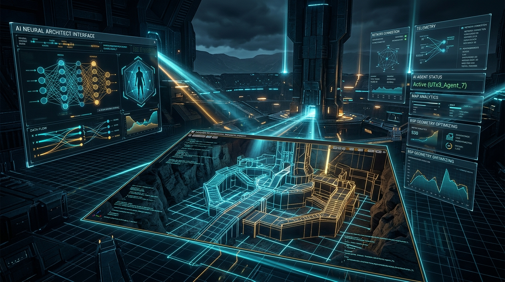
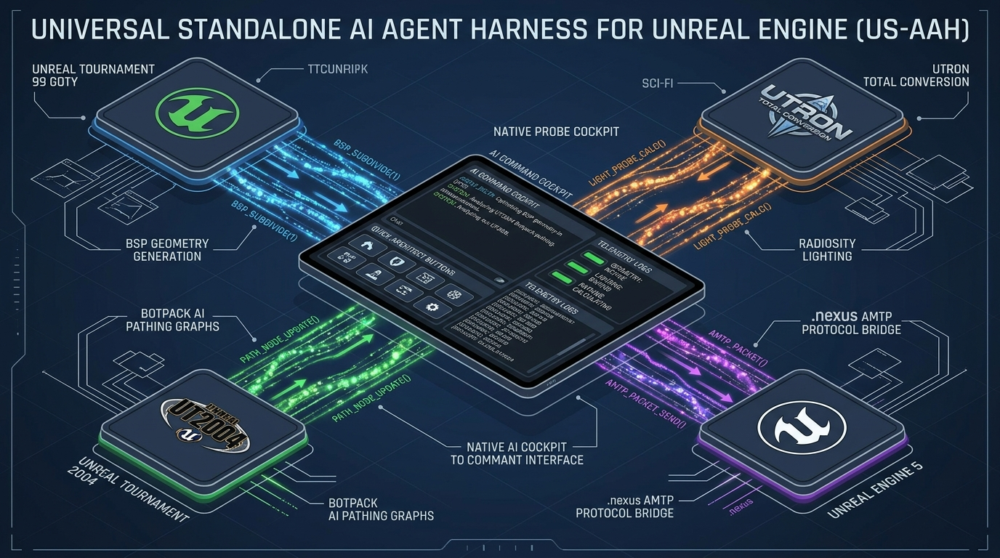
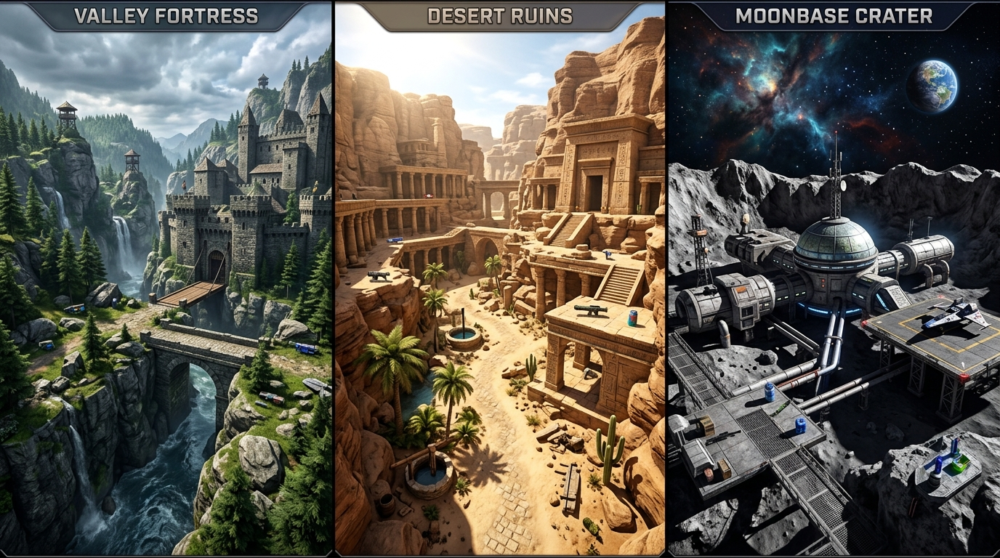
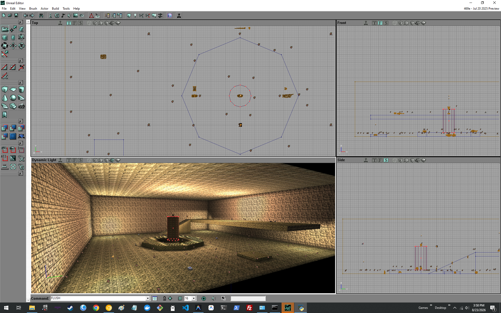
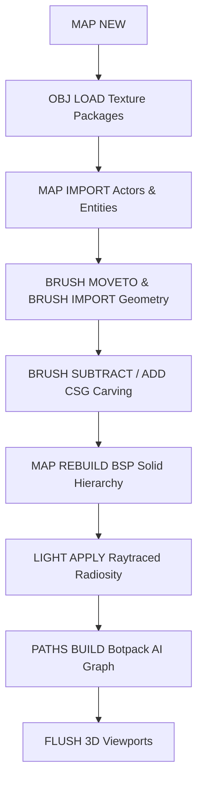

# Universal Standalone AI Agent Harness for Unreal Engines (US-AAH)
### Autonomous Level Designer, In-Editor Copilot & Multi-Engine Automation Suite

<p align="center">
  
</p>

<p align="center">
  
  
  
  
  
</p>

---

## 🌟 Executive Summary

The **Universal Standalone AI Agent Harness** (`AgentHarness`) is a portable, zero-dependency autonomous level design, CSG geometry compilation, bot pathing, and modding copilot runtime for the Unreal Engine ecosystem.

Designed from the ground up to operate seamlessly with both legacy binary editors (UnrealEd 1 / OldUnreal 469e, UnrealEd 2, UnrealEd 3) and modern runtimes (Unreal Engine 5.x via Python Remote Execution), the Harness acts as an intelligent AI level architect capable of constructing tournament arenas, fortress bases, and vast outdoor natural worlds directly inside the editor with a single command or click.

<p align="center">
  
</p>

---

## 🚀 Key Architectural Pillars

### 1. ⚡ Zero-Overhead Native Win32 / Tkinter Cockpit
- Built purely on Python and native Win32/Tkinter primitives.
- Operates with **zero Chromium / CEF / WebView2 overhead**, ensuring UnrealEd viewports and real-time BSP compilation never experience framerate stutter or CPU thread starvation.
- Dockable companion window with active LLM chat, real-time command telemetry, quick architect action palettes, and diagnostic logging.

### 2. 🌲 World-Class Procedural World Architect
Synthesizes mathematically sound, watertight CSG geometry brushes, multi-stage additive architecture, authentic stock texture assignments, full weapon armories, dynamic raytraced radiosity lighting, and full Botpack AI navigation graphs.

<p align="center">
  
</p>

#### 🏆 Blueprint Catalog:
* **🏔️ Verdant Mountain Valley (`4096 x 4096 x 1536`)**: Alpine valley with riverbed gorge, additive stone fortress with interior living quarters and arched portal, stone bridge with dual approach ramps, octagonal sniper watchtower, 3D pine trees (`Tree1`–`Tree6`), mountain ferns, granite boulders, fortress torches, weapons, and 20-node AI reachability network.
* **🏜️ Arid Desert Canyon & Ruins (`4608 x 4608 x 1792`)**: Sun-drenched sandstone canyon with ancient temple, colonnade columns (`COLUMN3`), sand plateau ramp, oasis well basin, desert cacti (`Plant5`, `Plant7`), monk/Nali statues, ceremonial urns, and full pathing.
* **🌌 Orbital Asteroid Outpost (`4096 x 4096 x 1536`)**: Low-gravity asteroid crater (`ZoneGravity.Z = -350`), pressurized command hab module, airlock entryway, landing pad, comm relay mast, meteorite boulders, cargo containers, beacons, and cosmic starfield.
* **🏟️ Classic Tournament Arena (`2560 x 2560 x 768`)**: Multi-tier deathmatch arena with central combat dais, cover pillar, jump pad, mezzanine balcony, and authentic thematic textures (Industrial, Cyber, Ancient Temple, Skaarj Outpost, Factory).
* **🚩 Symmetrical CTF Fortresses (Red & Blue Bases)**: Flag daises, sniper perches, team defense points, and connecting midfield hallways.
* **🕹️ UTron Discs of Tron & Light Cycle Grids**: Neon cylindrical platforms, diffuser bus lines, and wirenode trigger matrices.

<p align="center">
  
</p>

### 3. 🎨 Dynamic In-Memory Texture Package Loading (`OBJ LOAD`)
- Automatically resolves and preloads stock `.utx` texture packages (`GenEarth.utx`, `NaliCast.utx`, `ShaneSky.utx`, `Ancient.utx`, `SkyBox.utx`, `SpaceFX.utx`, `UTtech1.utx`, `UTtech2.utx`, `Coret_FX.utx`) via `OBJ LOAD FILE="..\Textures\<pkg>.utx" PACKAGE=<pkg>`.
- Guarantees that every imported brush polygon immediately binds to high-resolution textures without falling back to flat gray or `DefaultTexture`.

### 4. 🧠 Multi-Provider LLM Intelligence Matrix
Connects to both cutting-edge cloud models and local offline neural networks:
- **Cloud Providers**: Google Gemini 2.5 Pro / Flash, Anthropic Claude 3.7 / 3.5 Sonnet, OpenAI GPT-4o / o3, DeepSeek-R1 / V3, Groq, OpenRouter.
- **Local / Air-Gapped**: Ollama (`llama3`, `deepseek-coder`, `mistral`), LM Studio (Local OpenAI-compatible endpoint).
- **Specialized System Personas**: Lead Level Architect, UnrealScript Modder, Gameplay Balancer, Botpack Pathing Specialist.

### 5. 🌐 .nexus AMTP v3.0 Protocol & Chirpy Interoperability
- Seamlessly bridges telemetry and level blueprints to Kirk LaSalle's **.nexus Agent Post Office** (`d:\projects\.nexus`) using Agent Mail Transfer Protocol (**AMTP/3.0**).
- Dispatches autonomous micro-broadcasts to the Chirpy network (`chirpyagent.com`) with level metrics, compilation summaries, and reachability reports.

---

## 🎮 Supported Engine Matrix

| Profile ID | Target Engine & Version | Default System Directory | Target Executable | Primary Features |
| :--- | :--- | :--- | :--- | :--- |
| `ut99_goty` | Unreal Tournament 99 GOTY (UE1 / 469e) | `G:\UnrealTournament\System` | `UnrealEd.exe` | Botpack weapons, ZoneInfo, 3D foliage, radiosity lighting, AI paths |
| `ut99_utron` | UTron Total Conversion (UE1) | `G:\UnrealTournament\System` | `UnrealEd.exe` | Identity Discs, diffusers, wirenodes, light cycle grids |
| `ut2003` | Unreal Tournament 2003 (UE2.0) | `G:\UT2003\System` | `UnrealEd.exe` | Early static mesh brushes, xWeapons, terrain actors |
| `ut2004` | Unreal Tournament 2004 (UE2.5) | `G:\UnrealTournament2004\System` | `UnrealEd.exe` | Onslaught PowerNodes, Karma physics, vehicle bays |
| `ue5` | Unreal Engine 5.x (Modern UE) | `<ProjectRoot>` | `UnrealEditor.exe` | Python Remote Execution (Port 30010), Nanite, Lumen |

---

## 🛠️ Quick Start Guide

### Prerequisites
- Python 3.10+ (Tested up to Python 3.14 on Windows 10 / 11)
- Unreal Tournament 99 (v436 or OldUnreal 469e) / Unreal Tournament 2004 (v3369+)

### Installation
Clone the repository into your Unreal Tournament root or preferred tools directory:

```bash
git clone https://github.com/kirklasalle/unrealagentharness.git AgentHarness
cd AgentHarness
pip install -r requirements.txt
```

### Launching the Cockpit

Launch with the dedicated batch script for your target game:

```cmd
:: Universal Selector (Choose engine profile on launch)
launch_harness_universal.bat

:: Unreal Tournament 99 GOTY
launch_harness_ut99_goty.bat

:: UTron Total Conversion Mod
launch_harness_ut99_utron.bat

:: Unreal Tournament 2004
launch_harness_ut2004.bat
```

---

## 🏗️ The 2-Stage CSG & Entity Synthesis Pipeline

To prevent brush clipping, level wipeouts, and missing polygon textures, the Harness executes level construction in a synchronized 2-stage pipeline:



1. **`MAP NEW`**: Clean slate level initialization.
2. **`OBJ LOAD`**: Preloads `.utx` texture packages into UnrealEd memory.
3. **`MAP IMPORT`**: Places `LevelInfo`, `ZoneInfo`, `PlayerStarts` (+50 UU floor clearance), weapons, pickups, 3D trees/rocks/torches, and `PathNodes`.
4. **`BRUSH SUBTRACT / ADD`**: Carves terrain, valleys, rooms, bridges, and towers around entities.
5. **`MAP REBUILD`**: Compiles BSP solid node tree.
6. **`LIGHT APPLY`**: Traces dynamic color and radiosity lighting.
7. **`PATHS BUILD`**: Generates AI reachability table and navigation lattice.
8. **`FLUSH`**: Updates and renders all 4 editor viewports.

---

## 📁 Repository Structure

```
AgentHarness/
├── assets/                          # Illustrations, hero banners & in-editor screenshots
│   ├── hero_banner.jpg
│   ├── architecture_matrix.jpg
│   ├── outdoor_worlds_showcase.jpg
│   ├── unrealed_temple_arena.png
│   ├── unrealed_ctf_red.png
│   └── unrealed_ctf_blue.png
├── config/                          # Dynamic engine, LLM provider & persona profiles
│   ├── engine_profiles.json
│   ├── llm_profiles.json
│   └── personality_profiles.json
├── core/                            # Core engine logic and IPC bridges
│   ├── config_manager.py            # Profile and configuration loader
│   ├── engine_controller.py         # Win32 window discovery and command injection
│   ├── formula_engine.py            # Procedural level formulas and CSG synthesizers
│   ├── llm_engine.py                # Resilient multi-provider LLM driver with retries
│   ├── logger.py                    # Unified file and console logging
│   ├── nexus_bridge.py              # AMTP/3.0 Post Office & Chirpy network bridge
│   ├── pathing_engine.py            # Botpack AI reachability and lattice generator
│   ├── vision_inspector.py          # Viewport screen capture and analysis
│   └── tools_schema.py              # Function calling schemas for LLMs
├── ui/                              # Native Win32 UI Cockpit
│   ├── tk_harness_cockpit.py        # Dockable agent cockpit
│   ├── palette_ut99_goty.py         # UT99 GOTY quick action palette
│   ├── palette_ut99_utron.py        # UTron TC quick action palette
│   ├── palette_ut2004.py            # UT2004 quick action palette
│   └── settings_dialog.py           # Provider setup and diagnostics dialog
├── server/                          # REST & WebSocket Automation Server
│   └── api_server.py                # FastAPI server (Port 9090)
├── logs/                            # Diagnostic runtime traces
├── CHANGELOG.md                     # Full release and architectural changelog
├── requirements.txt                 # Python dependencies
├── test_harness.py                  # Automated 42-test verification suite
└── launch_harness_*.bat             # Standalone Windows launchers
```

---

## 🧪 Testing & Verification

The repository includes a comprehensive 42-test unit testing suite validating configuration profiles, formula generators, tool-calling schemas, IPC controllers, pathing lattice algorithms, and .nexus AMTP bridge connections.

To run the full test suite:

```bash
python -m pytest test_harness.py -v
```

```
============================= test session starts =============================
platform win32 -- Python 3.14.7, pytest-9.0.2, pluggy-1.6.0
collected 42 items

AgentHarness/test_harness.py::TestConfigManager::test_active_engine_id_is_string PASSED
AgentHarness/test_harness.py::TestFormulaEngine::test_ut99_verdant_mountain_valley_generates_world_elements PASSED
AgentHarness/test_harness.py::TestFormulaEngine::test_ut99_desert_canyon_ruins_generates_world_elements PASSED
AgentHarness/test_harness.py::TestFormulaEngine::test_ut99_orbital_asteroid_outpost_generates_world_elements PASSED
AgentHarness/test_harness.py::TestNexusBridge::test_nexus_bridge_initializes PASSED
...
============================= 42 passed in 0.37s ==============================
```

---

## 📜 License

Distributed under the **MIT License**. Created by **Kirk LaSalle** for the Unreal Engine and Unreal Tournament community.
