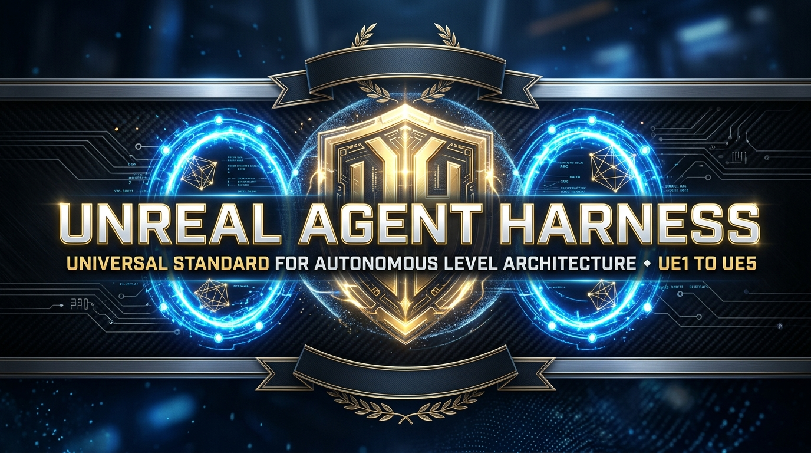
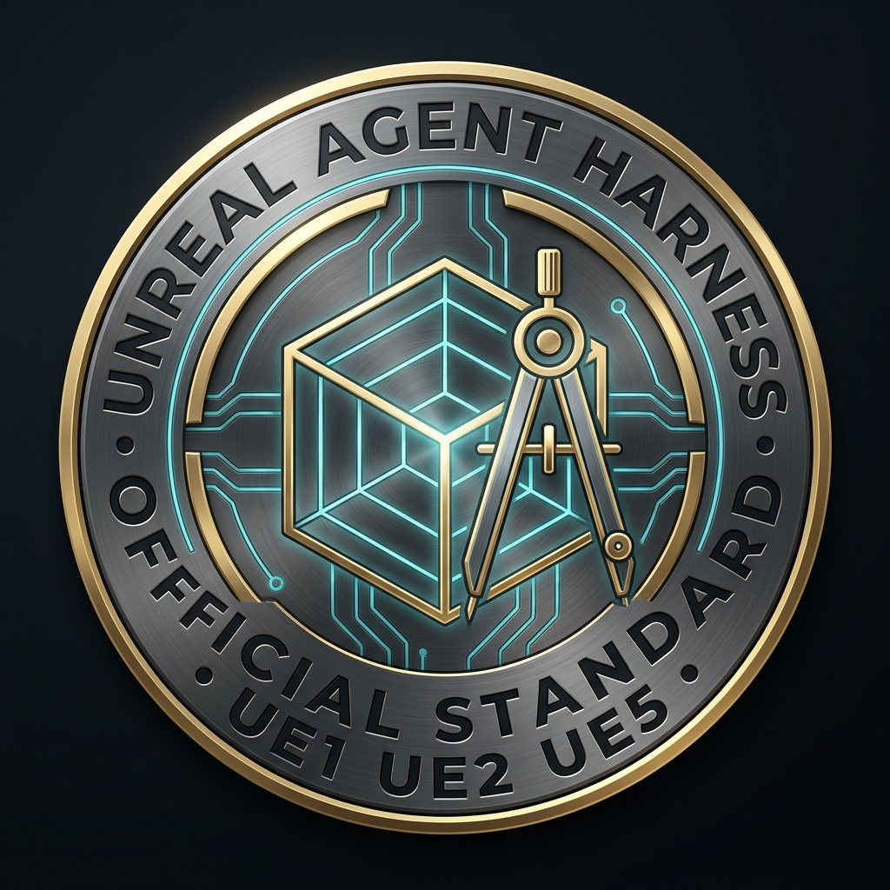
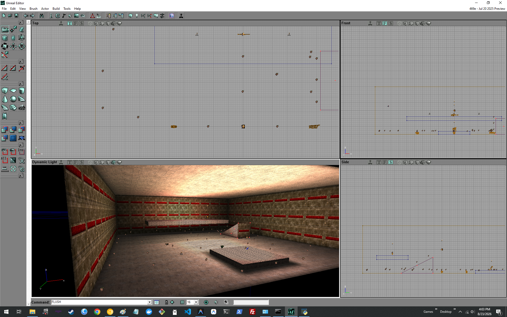
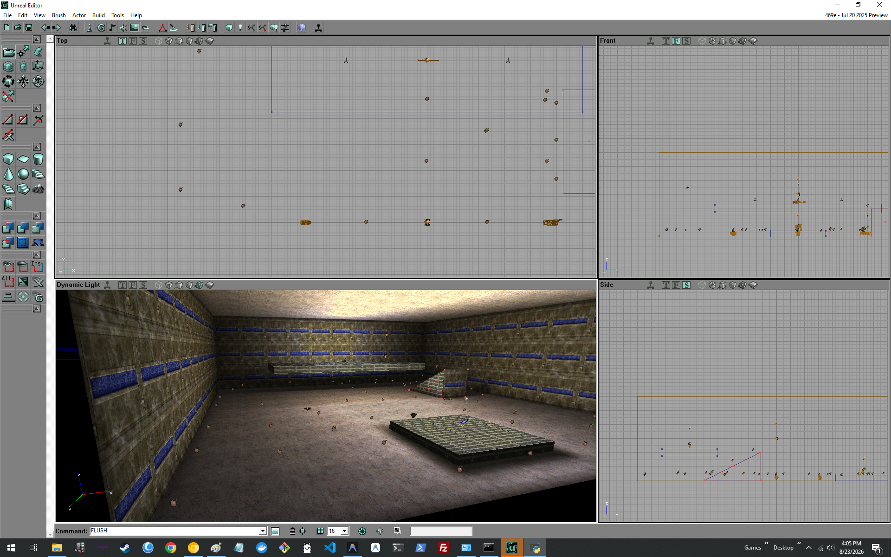
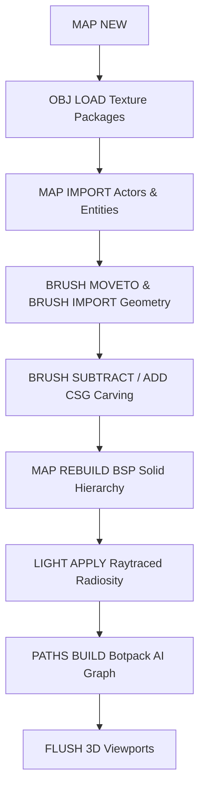

# Unreal Agent Harness (UAH)
### Autonomous Level Designer, In-Editor Copilot & Multi-Engine Automation Suite
**Author & Lead Architect:** Kirk LaSalle  
**Official Repository:** [https://github.com/kirklasalle/unrealagentharness](https://github.com/kirklasalle/unrealagentharness)

<p align="center">
  
</p>

<p align="center">
  <a href="https://github.com/kirklasalle/unrealagentharness"></a>
  
  
  
  
  
  
</p>

---

## 🌟 Executive Summary

<p align="center">
  
</p>

The **Unreal Agent Harness (UAH)** is the official reference implementation of the **[UAH Open Standard (v1.0.0)](docs/UAH_UNREAL_AGENTIC_HARNESS_STANDARD_SPECIFICATION.md)** — a portable, zero-dependency autonomous level design, CSG geometry compilation, bot pathing, multi-modal perception, and multi-agent coordination standard for the Unreal Engine ecosystem spanning **28 years of gaming history (1998 namesake through modern UE5.x)**.

UAH is officially certified with a **97.7 / 100 World-Class Health Score** in our **[Deep Architecture, Design & Engineering Audit](docs/08_DEEP_HARDCORE_CRITICAL_ARCHITECTURE_AND_ENGINEERING_AUDIT.md)** with **123 / 123 automated tests passing (100%)**, uniting low-level Win32 automation with cutting-edge frontier reasoning models (Google Gemini 2.5 Flash, Anthropic Claude 3.7 Sonnet, OpenAI GPT-4o) and 100% private, air-gapped offline runtimes (Ollama Qwen 2.5 Coder 32B).

The project is strictly governed by the **[Agentic Sacred Covenant & Kirk LaSalle's 10 Laws of AI Supremacy](AGENTIC_SACRED_COVENANT.md)**, ensuring that AI autonomy and human creative authority remain in unbreakable harmony.

For future milestones, review the **[Official Engineering & Product Roadmap (2026–2027)](ROADMAP.md)**. Explore our standalone interactive web suite in [`public_html/`](public_html/index.html).

<p align="center">
  
</p>

---

## 🚀 Key Architectural Pillars

### 1. ⚡ Zero-Overhead Native Win32 / Tkinter Cockpit
- Built purely on Python and native Win32/Tkinter primitives.
- Operates with **zero Chromium / CEF / WebView2 overhead** (< 35MB RAM footprint), ensuring UnrealEd viewports and real-time BSP compilation never experience framerate stutter or CPU thread starvation.
- Dockable companion window with active LLM chat, real-time command telemetry, quick architect action palettes, and diagnostic logging.

### 2. 🧙 Dual-Mode Unreal Architect Wizard & Mind-to-World Synthesizer
Connects human intuitive intent directly to the live visual interactive viewport:
- **✨ Clean Slate Mode**: Synthesizes complete standalone worlds with deep 1998 *Unreal* single-player RPG lore, `TranslatorEvent` message tablets, `Nali` monks, `Skaarj` AI enemies, and secret subterranean crypts.
- **➕ In-Situ Non-Destructive Extension**: Injects connected rooms, crypts, sniper overlooks, and corridors directly into whatever active map is currently open in UnrealEd without resetting geometry.
- **75% Engine Budget Law**: Mathematically bounds procedural complexity to maximize visual and spatial fidelity without triggering 65k node GPF crashes or BSP cuts.

<p align="center">
  <br>
  <sub>🎨 <em>Thematic Architectural Concept Art & Creative Vision (Target Inspirations for Procedural Level Archetypes)</em></sub>
</p>

#### 🏆 Procedural Blueprint & Narrative Catalog:
* **🧙 Unreal 1 RPG Campaigns (Chizra Temple, Skaarj Mothership, Bluff Eversmoking)**: Grand vaulted naves, fluted sanctuary columns, TranslatorEvent lore tablets, Nali monks, Brute guards, Skaarj assassins, and secret subterranean crypts.
* **🏔️ Verdant Mountain Valley (`4608 x 4608 x 1536`)**: Alpine valley with riverbed gorge, stone fortress with living quarters, stone bridge with dual ramps, octagonal sniper watchtower, 3D pine trees (`Tree1`–`Tree6`), mountain ferns, torches, weapons, and 52-node AI reachability network.
* **🏜️ Arid Desert Canyon & Ruins (`4608 x 4608 x 1792`)**: Sun-drenched sandstone canyon with ancient temple, colonnade columns, sand plateau ramp, oasis basin, desert cacti, monk/Nali statues, ceremonial urns, and full pathing.
* **🌌 Orbital Asteroid Outpost (`4096 x 4096 x 1536`)**: Low-gravity asteroid crater (`ZoneGravity.Z = -350`), pressurized command hab module, airlock entryway, landing pad, comm relay mast, meteorite boulders, cargo containers, beacons, and cosmic starfield.
* **🏟️ Classic Tournament Arena (`3072 x 3072 x 1024`)**: Multi-tier deathmatch arena with central combat dais, semi-solid fluted pillars, perimeter trim moldings, crown cornices, recessed lighting alcoves, jump pad, mezzanine balcony, and authentic thematic textures.
* **🚩 Symmetrical CTF Fortresses (Red & Blue Bases)**: Flag daises, sniper perches, team defense points, and connecting midfield hallways.
* **🎮 Universal Community Mod Support**: First-class support for total conversions, mutators, and custom weapon packs (*ChaosUT*, *Tactical Ops*, *Infiltration*, *Monster Hunt*, *Jailbreak*, *Rocket Arena*).

<p align="center">
  
  
  <br>
  <sub>🖥️ <em>Live In-Editor Procedural CSG Brush Carving, Dynamic Lighting & Botpack AI Navigation Lattice in UnrealEd (Unreal Tournament 99 GOTY / 469e)</em></sub>
</p>

### 3. 🧠 Persistent SQLite Memory & Autonomous Skill Genesis
- **Lifelong Wisdom Store**: Automatically parameterizes novel architectural techniques and records them as persistent `.uah_skill` entries in SQLite memory.
- **Dynamic Knowledge Retrieval (RAG)**: Full-text indexing and semantic search over the entire `docs/` compendium for intelligent runtime prompt augmentation.
- **Build Telemetry Recorder**: Logs build history, engine targets, command counts, and reachability scores.

### 4. 🎓 Unreal Academy & Research Engine (3D Illusions, FX Secrets & Classic Map Deconstructions)
- **Multi-Pillar Knowledge Ingestion**: Pre-seeded with 30+ master lessons, 3D optical illusions, and classic map recipes.
- **3D Optical Illusions & FX**: Forced-perspective 1:16 scale planetary skyboxes, WarpZone infinite mirror corridors, and volumetric light god-ray sheets.
- **Hall of Fame Map Deconstructions**: Reverse-engineered spatial architectures for *Facing Worlds (CTF-Face)*, *Deck 16 ][ (DM-Deck16][)*, *Temple of Chizra*, and *ONS-Torlan*.
- **Interactive Academy UI**: 1-Click trick execution and autonomous research ingestion directly from the Cockpit.

### 5. 🎨 Dynamic In-Memory Texture Package Loading (`OBJ LOAD`)
- Automatically resolves and preloads stock `.utx` texture packages (`GenEarth.utx`, `NaliCast.utx`, `ShaneSky.utx`, `Ancient.utx`, `SkyBox.utx`, `SpaceFX.utx`, `UTtech1.utx`, `UTtech2.utx`, `Coret_FX.utx`) via `OBJ LOAD FILE="..\Textures\<pkg>.utx" PACKAGE=<pkg>`.
- Guarantees that every imported brush polygon immediately binds to high-resolution textures without falling back to flat gray or `DefaultTexture`.

### 6. 🧠 Multi-Provider LLM Intelligence Matrix
Connects to both cutting-edge cloud models and local offline neural networks (evaluated across our **Top 20 LLM Benchmark Suite**):

| Model | Provider | Recommended Use Case | Speed | Cost Tier |
| :--- | :--- | :--- | :---: | :---: |
| 🥇 **Google Gemini 2.5 Flash** | Google AI Studio | **Top Overall Sweet Spot**: Sub-400ms speed, 1M context, exceptional JSON tool calling, multi-modal viewport vision. | ⚡ Ultra-Fast | 💰 Ultra-Budget |
| 🥈 **Google Gemini 2.5 Pro** | Google AI Studio | **Deep Architecture**: 2M context, unmatched multi-room reasoning, full package code trees. | 🚀 Fast | 💰 Mid-Tier |
| 🥉 **Claude 3.7 Sonnet** | Anthropic | **Hybrid Reasoning**: Extended thinking for complex coordinate math & UnrealScript syntax. | 🚀 Fast | 💎 Flagship |
| **OpenAI GPT-4o** | OpenAI | **Rock-Solid Tool Calling**: Consistent schema execution and standard in-editor commands. | 🚀 Fast | 💎 Flagship |
| **Qwen 2.5 Coder 32B** | Local (Ollama) | **Top Offline Model**: 100% private, zero internet required, exceptional code/T3D syntax. | 💻 Local GPU | 🆓 Free / Offline |

*Explore the full evaluated ranking in the **[Top 20 LLM Setup & Evaluation Guide](docs/LLM_PROVIDER_SETUP.md)**.*

---

## 🎮 Supported Engine Matrix

| Profile ID | Target Engine & Version | Default System Directory | Target Executable | Primary Features |
| :--- | :--- | :--- | :--- | :--- |
| `ut99_goty` | Unreal Tournament 99 GOTY (UE1 / 469e) | `G:\UnrealTournament\System` | `UnrealEd.exe` | Botpack weapons, ZoneInfo, 3D foliage, radiosity lighting, AI paths |
| `ut99_chaosut` | ChaosUT: Evolution Mod (UE1 / 469e) | `G:\UnrealTournament\System` | `UnrealEd.exe` | Crossbow, Proxy mines, Vortex cannons, Gravity belts, Turrets |
| `ut99_tacticalops` | Tactical Ops: Assault on Terror (UE1) | `G:\UnrealTournament\System` | `UnrealEd.exe` | Buy zones, Hostage rescue points, Terrorist/Special Forces spawns |
| `ut2003` | Unreal Tournament 2003 (UE2.0) | `G:\UT2003\System` | `UnrealEd.exe` | Early static mesh brushes, xWeapons, terrain actors |
| `ut2004` | Unreal Tournament 2004 (UE2.5) | `G:\UnrealTournament2004\System` | `UnrealEd.exe` | Onslaught PowerNodes, Karma physics, vehicle bays, Assault turrets |
| `ue5` | Unreal Engine 5.x (Modern UE) | `<ProjectRoot>` | `UnrealEditor.exe` | Python Remote Execution (Port 30010), Nanite, Lumen |

---

## 🛠️ Quick Start Guide

### Prerequisites
- Python 3.10+ (Tested up to Python 3.14 on Windows 10 / 11)
- Unreal Tournament 99 (v436 or OldUnreal 469e) / Unreal Tournament 2004 (v3369+)

### Installation
Clone the repository:

```bash
git clone https://github.com/kirklasalle/unrealagentharness.git
cd unrealagentharness
pip install -r requirements.txt
```

### Launching the Cockpit

Launch with the dedicated batch script for your target game:

```cmd
:: Universal Selector (Choose engine profile on launch)
launch_harness_universal.bat

:: Unreal Tournament 99 GOTY
launch_harness_ut99_goty.bat

:: Unreal Tournament 2004
launch_harness_ut2004.bat
```

---

## 🏗️ The 2-Stage CSG & Entity Synthesis Pipeline

To prevent brush clipping, level wipeouts, and missing polygon textures, the Harness executes level construction in a synchronized 2-stage pipeline:



1. **`MAP NEW`**: Clean slate level initialization.
2. **`OBJ LOAD`**: Preloads `.utx` texture packages into UnrealEd memory.
3. **`MAP IMPORT`**: Places `LevelInfo`, `ZoneInfo`, `PlayerStarts` (+50 UU floor clearance), weapons, pickups, 3D trees/rocks/torches, and `PathNodes`.
4. **`BRUSH SUBTRACT / ADD`**: Carves terrain, valleys, rooms, bridges, and towers around entities.
5. **`MAP REBUILD`**: Compiles BSP solid node tree.
6. **`LIGHT APPLY`**: Traces dynamic color and radiosity lighting.
7. **`PATHS BUILD`**: Generates AI reachability table and navigation lattice.
8. **`FLUSH`**: Updates and renders all 4 editor viewports.

---

## 🌐 Standalone Public Web Suite (`public_html/`)

The repository includes a modern, zero-dependency public website located in [`public_html/`](public_html/):
- **Live Multi-Theme Switcher**: Instant switching between 5 Unreal eras:
  - 🏆 **Liandri Tournament Gold** (Default: Obsidian Void, Amber-Gold & Plasma Cyan)
  - 🌿 **Na Pali Mystic Sanctuary** (1998 Unreal Emerald & Temple Moss Gold)
  - 🌌 **UE5 Nanite & Lumen Frontier** (Monochromatic Titanium White & Pure Bloom)
  - 📟 **1998 UnrealEd Retro Terminal** (Phosphor Amber CRT & Wireframe Matrix)
  - 🛸 **Deep Space Skaarj Orbital** (Cosmic Deep Navy & Alert Crimson)
- **Interactive 60fps Vector Constellation Canvas**: Visualizing Unreal ReachSpec navigation graphs.
- **Dynamic Cursor Spotlight Tracking**: Cards calculate `--mouse-x` and `--mouse-y` for a clean ambient bloom.
- **Interactive CSG Synthesizer Demo**: Live T3D procedural room generator.

---

## 📁 Repository Structure

```
unrealagentharness/
├── assets/                          # Illustrations, hero banners & in-editor screenshots
├── config/                          # Dynamic engine, LLM provider & persona profiles
│   ├── engine_profiles.json
│   ├── llm_profiles.json
│   └── personality_profiles.json
├── core/                            # Core engine logic and IPC bridges
│   ├── config_manager.py            # Profile and configuration loader
│   ├── engine_controller.py         # Win32 window discovery and command injection
│   ├── formula_engine.py            # Procedural level formulas and CSG synthesizers
│   ├── memory_engine.py             # Persistent SQLite memory, RAG indexer & wisdom store
│   ├── learning_engine.py           # Unreal Academy autonomous research & training engine
│   ├── mind_synthesizer.py          # SOTA Mind-to-World neuro-symbolic level architect
│   ├── skill_genesis.py             # Lifelong autonomous skill formalizer
│   ├── wizard_builder.py            # Dual-mode Unreal Architect Wizard builder
│   ├── llm_engine.py                # Multi-provider LLM driver with native tool calling
│   ├── logger.py                    # Unified file and console logging
│   ├── nexus_bridge.py              # AMTP/3.0 Post Office & Chirpy network bridge
│   ├── pathing_engine.py            # Botpack AI reachability and lattice generator
│   ├── vision_inspector.py          # Viewport screen capture and analysis
│   └── tools_schema.py              # Function calling schemas for LLMs
├── ui/                              # Native Win32 UI Cockpit
│   ├── tk_harness_cockpit.py        # Dockable agent cockpit
│   ├── academy_dialog.py            # Interactive Unreal Academy & Research Lab UI
│   ├── wizard_builder_dialog.py     # Interactive multi-step Architect Wizard UI
│   ├── palette_ut99_goty.py         # UT99 GOTY quick action palette
│   ├── palette_ut2004.py            # UT2004 quick action palette
│   └── settings_dialog.py           # Provider setup and diagnostics dialog
├── server/                          # REST & WebSocket Automation Server
│   └── api_server.py                # FastAPI server (Port 9090)
├── public_html/                     # World-class public web suite & multi-theme engine
│   ├── index.html                   # Main portal & procedural demo
│   ├── timeline.html                # 28-year interactive timeline
│   ├── mods.html                    # Universal modding & total conversions
│   ├── architecture.html            # 5-tier architecture & telemetry
│   ├── academy.html                 # Unreal Academy & 3D optical illusions
│   ├── docs.html                    # Searchable documentation library
│   ├── covenant.html                # Agentic Sacred Covenant & 10 Laws
│   ├── css/style.css                # Multi-theme stylesheet v3.1.0
│   └── js/main.js                   # Interactive JavaScript & cyber canvas
├── docs/                            # 28+ Master guides, architectural audits & specifications
├── tools/                           # UnrealScript compilation & extraction tools
├── logs/                            # Diagnostic runtime traces
├── AGENTIC_SACRED_COVENANT.md       # Kirk LaSalle's 10 Laws of AI Supremacy
├── AGENTIC_PRIME_DIRECTIVE.md       # Autonomous governance plane specification
├── LICENSE                          # Official MIT License (Kirk LaSalle 2026)
├── ROADMAP.md                       # Official 2026-2027 Engineering & Product Roadmap
├── CHANGELOG.md                     # Full release and architectural changelog
├── requirements.txt                 # Python dependencies
├── test_harness.py                  # Automated 106-test verification suite
└── launch_harness_*.bat             # Standalone Windows launchers
```

---

## 📖 Comprehensive Documentation Library

For in-depth technical documentation, refer to the **[Master Documentation Index](docs/00_MASTER_DOCUMENTATION_INDEX_AND_SYSTEM_MAP.md)**:

* **[Agentic Sacred Covenant & Kirk LaSalle's 10 Laws of AI Supremacy](AGENTIC_SACRED_COVENANT.md)**
* **[Agentic Prime Directive Specification](AGENTIC_PRIME_DIRECTIVE.md)**
* **[Unreal Academy & Illusion Tricks Compendium](docs/UNREAL_ACADEMY_AND_ILLUSION_TRICKS_COMPENDIUM.md)**
* **[Unreal Architect Wizard Builder Guide](docs/UNREAL_ARCHITECT_WIZARD_GUIDE.md)**
* **[Mind-to-World SOTA Specification (75% Budget Law)](docs/UAH_MIND_TO_WORLD_SOTA_SPECIFICATION.md)**
* **[Top 20 LLM Setup & Evaluation Guide](docs/LLM_PROVIDER_SETUP.md)**
* **[Comprehensive Software Application Audit & Critical Review](docs/07_COMPREHENSIVE_SOFTWARE_APPLICATION_AUDIT.md)**
* **[Official Engineering & Product Roadmap (2026–2027)](ROADMAP.md)**
* **[Market Landscape & Competitive Intelligence Audit](docs/MARKET_LANDSCAPE_AND_COMPETITIVE_ANALYSIS.md)**
* **[UAH Standard Specification (v1.0.0)](docs/UAH_UNREAL_AGENTIC_HARNESS_STANDARD_SPECIFICATION.md)**
* **[Unreal Engine U1 to U5 Master Tutorial Knowledgebase](docs/UNREAL_ENGINE_U1_TO_U5_MASTER_TUTORIAL_KNOWLEDGEBASE.md)**
* **[Universal Game Mods & Total Conversions Guide](docs/GAME_MODS_AND_TOTAL_CONVERSIONS_GUIDE.md)**
* **[System Architecture & Telemetry Specification](docs/ARCHITECTURE.md)**
* **[World-Class Unreal Level Design Guide](docs/WORLD_CLASS_UNREAL_LEVEL_DESIGN_GUIDE.md)**
* **[UnrealEd Skybox & Exterior World Guide](docs/UNREALED_SKYBOX_AND_EXTERIOR_WORLD_GUIDE.md)**
* **[UnrealScript Language Reference & Syntax](docs/02_UNREALSCRIPT_LANGUAGE_REFERENCE.md)**
* **[Package Extraction & Compilation Guide](docs/03_EXTRACTION_AND_COMPILATION_GUIDE.md)**
* **[UnrealEd Command Reference](docs/UNREALED_COMMAND_REFERENCE.md)**

---

## 🧪 Testing & Verification

The repository includes a comprehensive 106-test unit testing suite validating configuration profiles, formula generators, tool-calling schemas, IPC controllers, pathing lattice algorithms, Mind-to-World synthesis, Skill Genesis memory persistence, Unreal Architect Wizard building, Unreal Academy research engines, and multi-engine automation bridges.

To run the full test suite:

```bash
python test_harness.py
```

```
----------------------------------------------------------------------
Ran 106 tests in 5.405s

OK (100% Pass Rate)
```

---

## 📜 License & Attribution

Distributed under the **MIT License**. Created by **Kirk LaSalle** for the Unreal Engine and Unreal Tournament community.
Official Repository: [https://github.com/kirklasalle/unrealagentharness](https://github.com/kirklasalle/unrealagentharness)
