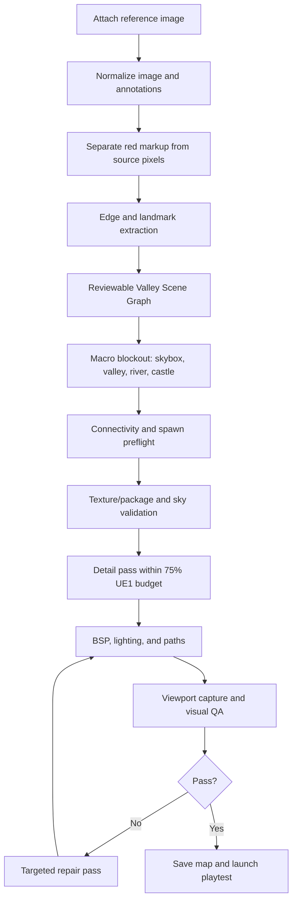

# Proposal for Approval: Valley Fortress Vision, Reliability & Cockpit Elevation

**Author:** Kirk LaSalle & Unreal Agent Harness Engineering
**Date:** 2026-08-30
**Status:** **APPROVED — foundation implementation authorized by Kirk LaSalle on 2026-08-30**
**Scope:** UT99 / OldUnreal 469e Valley Fortress, multimodal reference analysis, playtest reliability, provider configuration, engine discovery, chat artifacts, cockpit UX, and durable memory.

---

## 1. Approval Record and Execution Scope

Gate A is approved. Foundation implementation is now authorized for reference analysis, graph memory, map hardening, playtest gating, provider/profile restoration, quick engine inventory, additive cockpit controls, and local chat artifact staging. The scene-graph-to-macro coordinate transform, controlled standard-detail blockout tool, build manifest, editor-log gate, provider payload adapters, and artifact tray are now implemented. Gates B–D remain acceptance checkpoints for reference-driven geometry, blockout playtest, and final high-detail certification.

The remaining work is intentionally not considered complete until its runtime and visual acceptance criteria pass. The latest implementation also adds observable staged command execution, a separate generated-map validation tool, a viewport visual smoke gate, and a normalized edge-column profile, so command delivery is reported by stage and stops at the first failed command.

## 1.1 Executive Decision Requested

Approve a staged engineering programme that treats the supplied Valley Fortress image as a **measured visual reference**, not merely a natural-language prompt. The agent will first extract a normalized scene graph and macro edge layout, then compile the world from macro silhouette to playable detail, validate it in UnrealEd, and only then launch a playtest.

This proposal deliberately separates:

1. **Reference analysis** — image ingestion, red-annotation interpretation, edge/landmark extraction, and a reviewable scene graph.
2. **World synthesis** — terrain, skybox, fortress, bridges, water, foliage, materials, lighting, and navigation.
3. **Reliability gates** — map save, package/class validation, spawn-fit validation, BSP/HOM checks, and playtest launch.
4. **Operator experience** — provider/model settings, fast engine discovery, chat artifacts, and a cleaner cockpit layout.
5. **Memory** — short-term conversation/artifact context and long-term reusable architectural knowledge graph records.

### Approval gates

- **Gate A:** Approve the architecture and UI layout in this document.
- **Gate B:** Approve the first reference-analysis artifact and scene graph before geometry generation.
- **Gate C:** Approve a low-detail blockout playtest before the 75% detail pass.
- **Gate D:** Approve the final high-detail build after automated and visual QA.

No destructive replacement of existing UI or builders is proposed. New functionality will be additive and existing WebSocket/client wiring will be preserved.

---

## 2. Evidence-Based Audit Findings

### 2.1 The current map is not a measured recreation

`core/formula_engine.py` currently represents the principal valley shell as a six-face rectangular subtractive box (`ValleyMain.t3d`). The added terraces and decorations improve density, but they do not establish the reference image's defining macro silhouette:

- left and right mountain masses converging toward a distant valley;
- a central river axis descending through the composition;
- a high fortress occupying the upper-right/east ridge;
- a lower masonry bridge in the foreground;
- an upper timber bridge approaching the castle gate;
- waterfall faces on the left cliff;
- layered tree lines framing the view.

The next iteration must be **edge- and landmark-driven**. Polygon count alone cannot correct a wrong silhouette.

### 2.2 The supplied runtime log identifies a concrete play failure

`G:\UnrealTournament\System\UnrealTournament.log` records:

- map load succeeded for `Autoplay.unr`;
- `Game class is 'DeathMatchPlus'`;
- player login failed at `Autoplay.PlayerStart3`;
- `Warning: Login failed: Failed to spawn player actor`;
- the game then terminated during `UGameEngine::Init`.

The generated actor file places `PlayerStart3` at `(576,-576,1074)` on the castle tower level. It also places navigation nodes close to several starts. The exact spawn rejection must be resolved by a preflight fit test rather than guessed offsets. The proposed validator will reject starts that are embedded, unsupported, inside a decorative merlon/tower volume, outside a walkable surface, or too close to another start/path anchor.

### 2.3 The runtime build log shows geometry quality warnings

`G:\UnrealTournament\System\Editor.log` reports `FPoly::Fix: Collapsed a point` while importing `BridgeArchRib.t3d`. It also reports many `Scout didn't fit` and `No valid start found` messages during path construction. These are objective signals that the current build is delivered to the editor but is not yet a reliable playable map.

The build system currently reports command delivery success. It does not yet treat UnrealEd log warnings, invalid spawn fits, stale map saves, or failed runtime initialization as build failures.

### 2.4 Skybox failure is a pipeline and validation problem, not just a texture problem

The current generated assets contain a `SkyZoneInfo` actor and a ceiling polygon flagged `4194432` (`PF_FakeBackdrop | PF_Unlit`). However, the screenshot still shows a flat red-tiled ceiling rather than the intended alpine sky. The implementation must verify all of the following at runtime:

- the playable sky-facing surfaces are actually the surfaces visible from the player route;
- `SkyZoneInfo` is in the intended isolated sky zone;
- the sky package and texture resolve to a real imported texture;
- no old map surface or stale level is being viewed;
- the sky chamber is not accidentally being treated as ordinary visible geometry;
- the post-build perspective screenshot contains the expected sky gradient rather than a repeated opaque material.

A successful `OBJ LOAD` or `MAP IMPORT` command is not sufficient evidence.

### 2.5 Existing source/config audit

- The current source includes an LLM Providers tab in `ui/settings_dialog.py` with API key, model, and base URL fields. If it is missing at runtime, the first diagnostic is a stale launcher/process or a different checkout, not an absent implementation.
- `config/llm_profiles.json` currently contains provider/model profiles and a valid active profile, but `ConfigManager.get_active_llm_profile_id()` has a fallback identifier that does not match the configured profile naming. This should be normalized during the provider restoration phase.
- `EngineScanner.scan_all()` performs a broad all-drive candidate scan. The UI starts it in a worker, but the candidate strategy still probes many locations and has no quick inventory mode, cancellation, or per-path verification display.
- The cockpit chat currently provides a single text entry and send button. There is no artifact registry or attachment toolbar in `ui/tk_harness_cockpit.py`.
- `VisionInspector` captures viewport images and encodes them for inference, but it does not yet calculate reference edges, red markup masks, scene landmarks, or map-quality findings.

---

## 3. Proposed Reference-to-World Pipeline

### 3.1 Annotation-aware image reading

The red circles and red edge guides are treated as **operator annotations**, not as geometry. The analysis pass will:

1. detect red markup using HSV thresholds and connected components;
2. remove or mask markup before ordinary edge detection;
3. preserve a separate annotation layer containing the castle and skybox regions;
4. run grayscale Sobel/Canny-style edge extraction on the clean image;
5. classify edges into terrain ridge, architecture, bridge, river, waterfall, horizon, tree mass, and foreground rock bands;
6. normalize coordinates into `[0,1]` image space so the same reference can drive different map scales;
7. emit a reviewable JSON scene graph and a diagnostic overlay image.

The agent must distinguish **visual edges** from **annotation edges**. It must never turn a red circle into a wall.

### 3.2 Normalized Valley Fortress scene graph

The first approved scene graph should contain at least:

- `skybox_dome`: upper 35–40% image region, cloud/mountain backdrop;
- `far_valley_horizon`: central distant mountain wedge;
- `west_cliff_mass`: left enclosing cliff and waterfall shelf chain;
- `east_fortress_mass`: upper-right castle silhouette and towers;
- `river_axis`: descending centerline from mid-distance to foreground;
- `upper_drawbridge`: castle gate connection;
- `lower_stone_bridge`: foreground crossing;
- `tree_line_west/east`: layered framing foliage bands;
- `foreground_boulder_field`: camera-facing rock and pine framing;
- `playable_route_graph`: castle route, bridge route, river route, and lookout route;
- `camera_validation_views`: one perspective and three orthographic validation views.

Every node will include normalized bounds, priority, target material family, target elevation band, and whether it is structural BSP, semi-solid decoration, actor foliage, or skybox content.

---

## 4. Proposed World-Building Architecture

### Phase W0 — Safe blockout

Construct only the macro masses using snapped, low-complexity structural brushes:

1. isolated skybox chamber and verified `SkyZoneInfo`;
2. open canyon silhouette with left/right stepped bedrock masses;
3. river channel and walkable banks;
4. castle foundation keyed continuously into the east ridge;
5. upper drawbridge and lower stone bridge;
6. one safe player start and one camera validation route.

The blockout must be captured and reviewed before adding foliage or decorative density.

### Phase W1 — Architectural silhouette

Replace the generic castle block with modular structural units:

- gatehouse and portal;
- central keep;
- four readable tower masses, each with floors and parapet level;
- roof planes and stepped roofline;
- courtyard and gate approach;
- wall walk and merlon rhythm;
- buttressed foundation keyed into the bluff;
- tower lookout platforms with valid walkable floors.

The castle must read correctly in the front and perspective views before surface decoration begins.

### Phase W2 — Terrain and water

Use a small number of large structural rock masses plus semi-solid ledges. Do not create a noisy grid of overlapping boxes. Add:

- three to five elevation terraces per visible cliff side;
- waterfall recesses that visibly connect source shelf to river basin;
- river banks with alternating stone shelves;
- lower bridge abutments that intersect bedrock;
- stepping stones only where a route is intentionally playable;
- distant mountain cards/meshes in the skybox for the far horizon.

### Phase W3 — Detail and atmosphere

Use stock UE1 assets only after the silhouette and routes pass QA:

- pine clusters with controlled spacing and height bands;
- ferns and shrubs near water and ledges;
- boulders at compositional anchors, never on spawn or path corridors;
- torches at gatehouse, towers, and bridge endpoints;
- material families for rock, castle masonry, timber, water, and vegetation;
- warm castle/torch light against cool sky/water fill.

### 75% UE1 budget policy

The budget is measured by categories rather than an unverified polygon claim:

- structural BSP: conservative and portal-friendly;
- semi-solid decoration: the primary detail multiplier;
- stock actor meshes: bounded by view importance and collision cost;
- path nodes: only on proven walkable surfaces;
- lights: clustered by zone, with a hard per-zone budget;
- no detail pass may proceed if BSP warnings, collapsed polygons, or invalid starts are present.

---

## 5. Playability and Runtime Reliability Proposal

### 5.1 Build manifest

Each build will create a manifest containing:

- source reference/artifact hashes;
- scene graph version;
- engine profile and exact executable;
- generated T3D assets;
- command sequence and timestamps;
- expected actors/classes;
- map output path;
- BSP/light/path log findings;
- viewport QA results;
- playtest result.

### 5.2 Preflight validator

Before `PATHS BUILD` or playtest:

- confirm `LevelInfo`, `ZoneInfo`, `SkyZoneInfo`, and compatible `DefaultGameType`;
- confirm at least one valid `PlayerStart` on a walkable floor;
- test every start for collision clearance and support below the player capsule;
- reject starts embedded in towers, merlons, bridge ribs, water, or cliffs;
- enforce minimum distance from other starts and path nodes;
- check pickups for collision embedding;
- validate that every generated class exists in the active engine profile/package set;
- scan `Editor.log` for `Collapsed a point`, `Scout didn't fit`, `No valid start`, and related warnings;
- save the map to a deterministic playtest filename before launching the game;
- launch only after the saved file exists and the selected game executable matches the engine profile.

### 5.3 Failure recovery

If playtest fails:

1. stop launch retry loops;
2. capture the game log and last editor screenshot;
3. identify the failing actor or class;
4. quarantine only the invalid actor/detail layer;
5. regenerate a safe start/route;
6. rebuild and re-run preflight;
7. require an explicit successful runtime boot before reporting success.

“Command delivered” must never be reported as “map playable.”

---

## 6. Cockpit UX Proposal

### 6.1 Additive layout change

Preserve all current controls and move only the primary build controls into a dedicated rail directly **above the Quick Architect Palette**, matching the requested composition:

- `WIZARD`
- `ACADEMY`
- `SCAN ENGINES`
- `LAUNCH EDITOR`
- `REBUILD`

Keep `DOCK`, `UPDATES`, and `SETTINGS` in the global header so utility actions remain available without crowding the build rail.

The new layout should be:

1. compact global header: brand, target, status, utility actions;
2. build rail above the palette: primary authoring actions;
3. left palette: categories, search/filter, build progress;
4. right chat: transcript, artifact tray, composer;
5. bottom status: current build stage, warnings, and verification state.

### 6.2 Chat artifacts

Add an additive artifact toolbar beside the composer:

- `📎 Attach file` — Markdown, text, JSON, T3D, logs, source documents;
- `🖼 Attach image` — PNG/JPG/BMP reference images;
- `🖥 Attach viewport` — current UnrealEd perspective/top/front/side captures;
- `🧹 Clear artifacts` — removes only current-turn attachments;
- artifact chips with name, type, size, hash, and remove action.

Artifacts will be staged, size-limited, hashed, and passed to the provider adapter. Documents become bounded text context; images become multimodal parts where the selected provider supports vision. The original file remains untouched.

### 6.3 Provider/model restoration

The existing provider tab will be elevated into a visible configuration workspace with:

- provider profile selector;
- model selector plus custom model field;
- API base URL;
- secure API key field;
- temperature/max-token controls where supported;
- vision/tool-calling capability badges;
- “Test connection” action;
- “Use for reference analysis” and “Use for map execution” roles;
- explicit active-profile indicator.

The implementation must normalize invalid active-profile fallbacks and display a clear warning when a provider is configured but not reachable. Keys must remain redacted in logs and excluded from chat history.

### 6.4 Engine discovery and editable paths

Replace the current all-drive-first experience with staged discovery:

- **Quick inventory:** running processes, configured paths, common local install roots;
- **Targeted scan:** user-selected roots with progress and cancellation;
- **Deep scan:** opt-in all-drive search with per-drive timing and skip controls;
- results table separating `Installed`, `Executable found`, `Packages found`, `Editor connected`, and `Verified`;
- editable `root_dir`, `system_dir`, editor executable, game executable, and launch arguments;
- Browse buttons and a per-profile Verify button;
- cached results with timestamp and “scan again” control.

The engine button should return an inventory quickly, then verify selected profiles independently. It must not block the cockpit or hide progress behind a modal.

---

## 7. Durable Memory and Graph Records

### Short-term memory

For each chat/build turn, retain:

- attached artifact IDs and hashes;
- active engine/provider/model;
- reference scene graph version;
- current build stage;
- unresolved warnings;
- operator approvals and rejected proposals.

### Long-term graph memory

Extend the persistent memory layer with graph-shaped records:

- `artifact` nodes: source images, documents, logs, T3D assets, screenshots;
- `scene` nodes: Valley Fortress, castle, river, skybox, bridge, cliff, route;
- `rule` nodes: skybox, BSP, spawn, lighting, package, and pathing rules;
- `build` nodes: command manifest, engine, map output, QA result;
- `finding` nodes: warning, failure, repair, confidence;
- edges such as `derived_from`, `contains`, `validated_by`, `failed_at`, `repaired_by`, and `approved_by`.

The graph records should be searchable through the existing RAG path so future image builds can retrieve prior edge interpretations, safe spawn offsets, valid stock classes, skybox repairs, and known UnrealEd failure signatures. A compact human-readable export should also be written beside build manifests for portability.

---

## 8. Documentation and Roadmap Changes Proposed

The following documents should receive the approved implementation record, not speculative completion claims:

- `ROADMAP.md` — add the Vision-to-World Reliability and Cockpit Elevation milestone;
- `docs/00_MASTER_DOCUMENTATION_INDEX_AND_SYSTEM_MAP.md` — index this proposal and its future analysis artifacts;
- `docs/07_COMPREHENSIVE_SOFTWARE_APPLICATION_AUDIT.md` — append the confirmed runtime findings from `Editor.log` and `UnrealTournament.log`;
- `docs/UNREALED_SKYBOX_AND_EXTERIOR_WORLD_GUIDE.md` — add the runtime skybox validation checklist;
- `docs/WORLD_CLASS_UNREAL_LEVEL_DESIGN_GUIDE.md` — add edge-driven macro blockout and spawn-fit gates;
- `docs/LLM_PROVIDER_SETUP.md` — document provider/model roles and artifact capability negotiation;
- `docs/Implementation Plan - World-Class Valley Fortress & Skybox Engine.md` — replace completion language with staged blockout, review, and QA gates;
- `CHANGELOG.md` and `docs/CHANGELOG.md` — record this as a proposal pending approval.

No document should claim that the Valley Fortress is fully playable or visually faithful until the runtime and viewport acceptance criteria below pass.

---

## 9. Acceptance Criteria

### Reference fidelity

- castle and skybox annotation regions align with the clean-reference scene graph;
- perspective blockout reads as a valley fortress before detail actors are added;
- lower bridge, upper drawbridge, river axis, west waterfall, and east castle are all visually distinct;
- orthographic views confirm the intended macro silhouette and grounded geometry.

### UnrealEd reliability

- zero `FPoly::Fix: Collapsed a point` warnings;
- zero invalid player starts;
- zero `Scout didn't fit` warnings for required navigation/pickup anchors;
- at least one verified runtime spawn;
- sky surfaces show the intended skybox rather than an opaque repeated ceiling;
- map is saved to a deterministic path before playtest launch.

### UX

- primary build controls appear above the Quick Architect Palette;
- provider and model selection are visible and editable;
- engine inventory appears quickly and supports editable paths;
- chat accepts documents, images, and viewport captures with removable artifact chips;
- all existing advanced controls remain available.

### Memory

- short-term turn context records artifacts and approvals;
- long-term memory stores the scene graph, build manifest, findings, and repair decisions;
- a future run can retrieve the Valley Fortress rules without depending on this conversation.

---

## 10. Recommendation

**Approve Gate A only.** After approval, implement the reference-analysis artifact and scene graph first. Do not increase polygon/detail budgets until the measured blockout, skybox validation, start-fit validator, and deterministic playtest save/launch path are working. This ordering directly addresses the observed failure: the current map has more objects, but not yet the correct world silhouette or runtime reliability.
