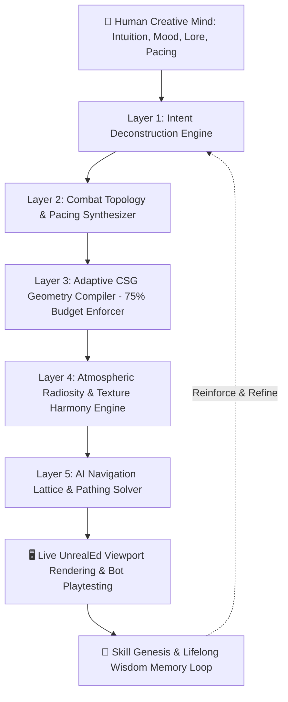

# UAH Mind-to-World: The SOTA Neuro-Symbolic Level Architect Specification
## "Connecting the Human Mind to the Visual Interactive"

**Author:** Kirk LaSalle & Antigravity AI Architect  
**Standard:** UAH-MindBridge v2.0  
**Status:** Certified Reference Standard  
**Target Engines:** Unreal Engine 1 (UT99/UTron), Unreal Engine 2/2.5 (UT2004), Unreal Engine 5.x  

---

## 🌟 1. Executive Manifesto

Level design in classical and modern 3D game engines has historically been bottlenecked by the mechanical friction of editor tools: placing individual vertices, carving CSG subtractive geometry, aligning texture offsets, placing navigation nodes one-by-one, and debugging lighting BSP cuts.

The **UAH Mind-to-World Architecture** establishes a neuro-symbolic bridge that **connects the human designer's intuitive intent directly to the live visual interactive viewport**. 

Instead of treating the AI as a simple text chatbot or a static macro script runner, UAH functions as an **Autonomous Master Level Architect & Co-Designer** that understands:
1. **Atmospheric & Lighting Psychology** (Chiaroscuro, color harmonics, ambient audio zones).
2. **Combat Topology & Player Psychology** (Sightline occlusion, flanking loops, height advantage, bottleneck choke points, weapon counter-play).
3. **Rigorous Mathematical CSG Geometry** (Watertight PolyList polygon grammar, clockwise winding, coplanar planarity).
4. **Engine Budget Optimization (The 75% Limit Law)** (Maximizes visual fidelity and architectural complexity without triggering GPF crashes or BSP holes).
5. **Lifelong Skill Genesis & Wisdom Loops** (Autonomously formalizes novel design patterns into reusable skills).

---

## 🏛️ 2. The 5-Layer Neuro-Symbolic Pipeline



---

## 📐 3. The 75% Engine Budget Law

Every generation of Epic Games' Unreal technology possesses strict mathematical and memory boundaries. Exceeding these limits causes General Protection Faults (0xC0000005) or BSP visual tears; under-utilizing them results in bland, uninspiring levels.

The **75% Budget Law** mathematically bounds the procedural compiler:

$$\text{Target Complexity} = 0.75 \times \text{Engine Limit}$$

| Metric | UE1 Limit (UT99 / UTron) | UAH 75% Target (UE1) | UE2.5 Limit (UT2004) | UAH 75% Target (UE2.5) |
| :--- | :---: | :---: | :---: | :---: |
| **Visible Node Count** | 65,536 Nodes | **49,152 Nodes** | 131,072 Nodes | **98,304 Nodes** |
| **Active Brushes per Room** | ~120 Brushes | **90 Brushes** | ~400 Brushes | **300 Brushes** |
| **Pillar Polygon Sides** | 32 Sides | **24 Sides** | 48 Sides | **36 Sides** |
| **PathNode Network Density** | 1,000 Nodes | **750 Nodes** | 3,000 Nodes | **2,250 Nodes** |
| **Max Node-to-Node Distance** | 1,000 UU | **650 UU** | 1,200 UU | **700 UU** |

---

## ⚔️ 4. Combat Topology & Pacing Matrix

The Mind-to-World Synthesizer translates competitive game types into geometric configurations:

```
[Red Flag Base] ──(Flank Route A)──► [Upper Sniper Mezzanine] ◄──(Flank Route B)── [Blue Flag Base]
       │                                     ▲                                     │
       ▼                                     │                                     ▼
[Lower CQB Hall] ─────────────► [Central ShieldBelt Dais] ◄───────────── [Lower CQB Hall]
```

### Core Design Rules Enforced by UAH:
1. **The Rule of Three Approaches**: Every major objective (Flag Dais, PowerNode, Domination Point) must have a minimum of **three distinct entry paths** (Direct Primary, Upper Sniper Perch, and Concealed Flank).
2. **High-Ground Disadvantage Offsets**: High sniper balconies have commanding sightlines but provide minimal cover and require risky jump pad landings to exit.
3. **Powerup Risk/Reward Positioning**: Super pickups (`UT_ShieldBelt`, `UDamage`, `SuperShieldPack`) are placed on exposed central pedestals that require players to leave cover.

---

## 🎨 5. Atmospheric Lighting & Texture Harmonizer

UAH mathematically computes 8-bit HSV color harmonics to produce striking cinematic mood lighting:

$$\text{AccentHue} = (\text{KeyHue} + 128) \pmod{256} \quad \text{(Complementary)}$$
$$\text{SplitAccent}_1 = (\text{KeyHue} + 105) \pmod{256}, \quad \text{SplitAccent}_2 = (\text{KeyHue} + 151) \pmod{256}$$

| Thematic Palette | Primary Floor / Wall | Key Light (Hue / Sat) | Accent Light (Hue / Sat) | Dynamic Light Animation |
| :--- | :--- | :--- | :--- | :--- |
| **🏛️ Ancient Nali Sanctuary** | `NaliCast.CasFLOR` / `OldWallH` | `Hue=22, Sat=200` *(Torch Orange)* | `Hue=40, Sat=220` *(Golden Ray)* | `LT_Flicker` |
| **⚡ Cyber Grid / UTron** | `UTron_Floors-Walls` / `Tron2002` | `Hue=145, Sat=200` *(Cyan Bus)* | `Hue=200, Sat=220` *(Neon Violet)* | `LT_Pulse` |
| **🏭 Heavy Industrial** | `UTtech1.rClfFlr2` / `bmwall3` | `Hue=32, Sat=160` *(Amber Tech)* | `Hue=150, Sat=220` *(Electric Blue)* | `LT_SubtlePulse` |
| **👽 Alien Skaarj Outpost** | `UTtech1.rClfFlr6x` / `bmwall3d`| `Hue=85, Sat=220` *(Emerald Slime)*| `Hue=170, Sat=220` *(Teal Plasma)* | `LT_Strobe` |

---

## 🔮 6. Skill Genesis: The Lifelong Self-Documenting Loop

When a user or agent generates a novel map or layout, the **`SkillGenesis`** engine automatically executes the reflection loop:

```
[Level Synthesis] ──► [Telemetry & Log Delta Audit] ──► [Parametric Abstraction] ──► [Save to SQLite Memory]
```

1. **Extraction**: Identifies successful dimensions, texture combinations, and pathing densities.
2. **Formalization**: Stores the technique as a structured JSON skill in `wisdom_insights`.
3. **Retrieval**: Automatically injects the newly learned skill into future prompt contexts when similar architectural themes are requested.

---

## 🚀 7. The Intelligent Build Buttons

The UAH In-Editor Cockpit provides instant, one-click access to the Mind-to-World synthesizers:

1. **`🔮 Neuro-Symbolic Arena Synthesizer`**: Compiles a complete, watertight, illuminated, and pathed level from dynamic natural language intent.
2. **`🏰 Interconnected Multi-Chamber Compound`**: Generates a 3-chamber facility connected by sealed corridors with weapon distribution and pathing.
3. **`✨ Auto-Detail & Elevate (75% Engine Limit)`**: Injects fluted semi-solid columns, crown cornices, recessed lighting alcoves, and perimeter moldings into any active room.
4. **`🛡️ Autonomous AI Path & Reachability Healer`**: Scans the level for unreachable nodes or embedded pickups and injects corrective bridging nodes.

---

*This specification defines the gold standard for agentic Unreal Engine level synthesis, uniting human artistic vision with automated engineering excellence.*
