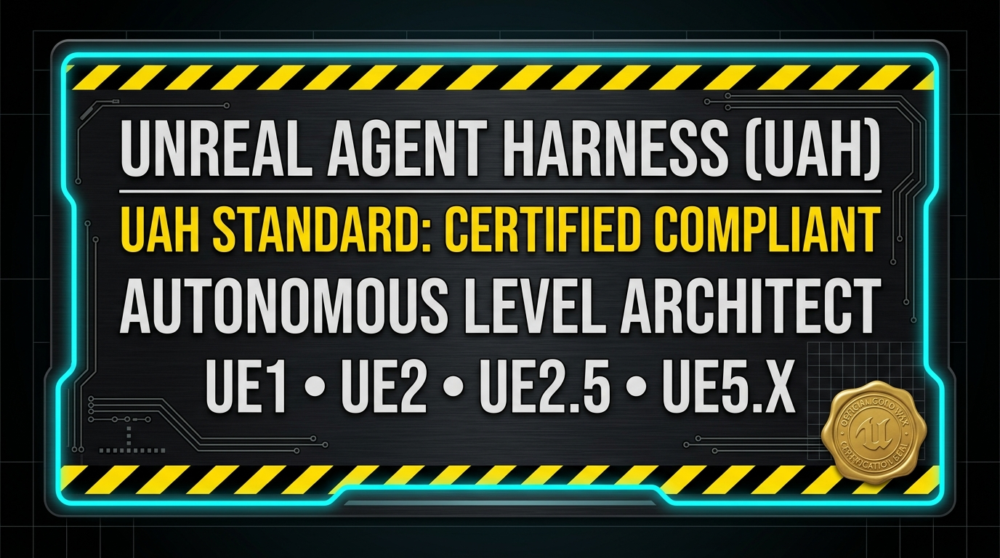

# UAH Standard: Unreal Agentic Harness Specification
**Version:** 1.0.0-PROPOSED  
**Status:** Open Standard Specification  
**Author:** Kirk LaSalle & Antigravity AI Systems  
**Repository:** [kirklasalle/unrealagentharness](https://github.com/kirklasalle/unrealagentharness)  

<p align="center">
  
</p>

---

## Abstract

The **Unreal Agentic Harness (UAH) Standard** defines an open, vendor-neutral, multi-generational interoperability specification for Autonomous Artificial Intelligence (AI) Agents interfacing with Epic Games' Unreal Engine technology. UAH standardizes bidirectional IPC execution, procedural geometry synthesis, state perception, multi-modal viewport inspection, bot navigation verification, and multi-agent coordination across **all five generations of Unreal technology (UE1, UE2/UE2.5, UE3, UE4, and UE5)**.

```
       ┌─────────────────────────────────────────────────────────┐
       │              AI LLM / Autonomous Agent                  │
       │    (Gemini / Claude / GPT / DeepSeek / Local SLMs)      │
       └────────────────────────────┬────────────────────────────┘
                                    │ (UAH Tool Schema & JSON IPC)
       ┌────────────────────────────▼────────────────────────────┐
       │             UAH UNIVERSAL AGENTIC HARNESS               │
       │  ┌───────────────────────────────────────────────────┐  │
       │  │ Pillar I: Engine Abstraction Layer (EAL)          │  │
       │  ├───────────────────────────────────────────────────┤  │
       │  │ Pillar II: Universal Command Protocol (UCIP)      │  │
       │  ├───────────────────────────────────────────────────┤  │
       │  │ Pillar III: Agentic Tooling Schema (ATFS)         │  │
       │  ├───────────────────────────────────────────────────┤  │
       │  │ Pillar IV: Multi-Modal Viewport Telemetry (MPVT)  │  │
       │  ├───────────────────────────────────────────────────┤  │
       │  │ Pillar V: Nexus Agent Coordination (SAC-POP)      │  │
       │  └───────────────────────────────────────────────────┘  │
       └──────┬─────────────────────┬─────────────────────┬──────┘
              │ (Win32 IPC/HWND)    │ (TCP / DLL IPC)     │ (Remote Control/REST)
       ┌──────▼──────┐       ┌──────▼──────┐       ┌──────▼──────┐
       │  UE1 / UE2  │       │     UE3     │       │  UE4 / UE5  │
       │  (UT99/2004)│       │    (UDK)    │       │ (Fortnite/5)│
       └─────────────┘       └─────────────┘       └─────────────┘
```

---

## 1. The Five Core Pillars of UAH

### Pillar I: Multi-Generational Engine Abstraction Layer (EAL)
The EAL standardizes how an agent harness discovers, initializes, and binds to any Unreal Engine instance on the host system without hardcoded environmental assumptions.

#### 1.1 Specification Requirements:
- **Engine Profiles (`uah:engine_profile`)**: Every target engine environment MUST declare a compliant profile defining:
  - `id`: Unique identifier (e.g., `ut99_goty`, `ut2004`, `ue5`).
  - `generation`: Recognized generation marker (`UE1`, `UE2`, `UE2.5`, `UE3`, `UE4`, `UE5`).
  - `category`: Engine classification (`Base Engine` vs `Game Mod / Total Conversion`).
  - `root_dir` & `system_dir`: Verified filesystem paths.
  - `editor_exe` & `game_exe`: Executable targets.
  - `signature_classes`: Key package and class signatures used by the LLM prompt synthesizer.
- **One-Time Verification & Persistence (`uah:verify`)**:
  - The harness MUST automatically verify target paths, executable existence, and package integrity upon engine selection.
  - The verification result (`initialized`, `verified`, `last_checked`, `summary`) MUST be persisted to JSON storage.
  - Subsequent invocations MUST consume the persisted state, avoiding redundant filesystem latency.
- **On-Demand Re-Check**:
  - The harness MUST expose an explicit `Re-Check` action to force live re-validation on demand.

---

### Pillar II: Universal Command & IPC Protocol (UCIP)
The UCIP standardizes how commands are serialized, dispatched, and confirmed across different engine process boundaries.

#### 2.1 IPC Bridge Taxonomy:
- **Generation 1 & 2 (UE1 / UE2 / UE2.5)**: Win32 native window messaging (`WM_SETTEXT`, `WM_KEYDOWN`, `VK_RETURN`) targeting `UnrealEd.exe` window class hierarchies (`UnrealEdUnrealEditorFrame`, `MDIClient`, `Edit`).
- **Generation 3 (UE3 / UDK)**: Named Pipes, Local TCP socket loops, or DLL injection bridges.
- **Generation 4 & 5 (UE4 / UE5)**: HTTP REST Remote Control API, WebSockets, or Python embedded runtime.

#### 2.2 Standard 3-Stage World Synthesis Pipeline:
Every UAH-compliant level generator MUST adhere to the standardized 3-stage synthesis protocol:
1. **Stage 1: Procedural CSG Architecture Synthesis**:
   - Generate watertight, planar T3D PolyList brush geometries.
   - Dispatch `BRUSH IMPORT FILE="..."` followed by `BRUSH SUBTRACT` or `BRUSH ADD`.
2. **Stage 2: Actor Map Import & Coordinate Space Normalization**:
   - Generate exact 3D coordinates for entities (Spawns, Weapons, Pickups, Vehicles, Navigation Nodes).
   - Dispatch `MAP IMPORT FILE="..."`.
3. **Stage 3: Level Compilation & Finalization**:
   - Issue universal sequence: `MAP REBUILD` $\to$ `LIGHT APPLY` $\to$ `PATHS BUILD` $\to$ `FLUSH`.

---

### Pillar III: Agentic Tooling & Function Calling Schema (ATFS)
The ATFS standardizes JSON Schema definitions for AI agents, guaranteeing compatibility across Gemini, Claude, GPT, and local open-weights SLMs.

#### Core Standard Tools:
| Standard Tool Identifier | Purpose | Required Arguments |
| :--- | :--- | :--- |
| `execute_unrealed_commands` | Raw batch command execution | `commands: List[str]` |
| `build_procedural_environment` | Parametric world creation | `archetype: str`, `width: int`, `length: int`, `height: int`, `theme: str` |
| `wire_navigation_lattice` | Procedural bot path generation | `bounds: Tuple[float, ...]`, `spacing: int`, `z_floor: float` |
| `audit_pathing_reachability` | ReachSpec graph diagnostics | `fix_gaps: bool` |
| `spawn_combat_vehicle` | Vehicle entity deployment | `vehicle_class: str`, `location: Tuple[float, float, float]` |
| `inspect_viewport_multimodal` | Visual perception capture | `viewport_id: str` |
| `switch_engine_profile` | Target engine context switch | `engine_id: str` |

---

### Pillar IV: Multi-Modal Perception & Viewport Telemetry (MPVT)
The MPVT standardizes how agents visually inspect the 3D world, assess lighting balance, detect geometry tears, and verify reachability.

#### 4.1 Specification Requirements:
- **Viewport Quadrant Normalization**:
  - `Quadrant 1 (Top-Left)`: Top-Down Orthographic (XY plane).
  - `Quadrant 2 (Top-Right)`: Perspective Real-Time Render (3D Lit/Textured).
  - `Quadrant 3 (Bottom-Left)`: Front Orthographic (XZ plane).
  - `Quadrant 4 (Bottom-Right)`: Side Orthographic (YZ plane).
- **Automated Anomaly Detection**:
  - Image sharpness / contrast metrics.
  - Black viewport detection (indicating missing lighting or invalid camera clipping).
  - Color histogram verification for atmospheric compliance.

---

### Pillar V: Shared Agentic Coordination & Post Office Protocol (SAC-POP / Nexus Bridge)
The SAC-POP standardizes how multiple specialized agents collaborate on complex level design projects.

#### 5.1 Architecture & Mailbox Structure:
- Agents communicate asynchronously through the standard `.nexus/` mailbox registry:
  - `.nexus/mailboxes/<agent_id>/inbox.jsonl`
  - `.nexus/mailboxes/<agent_id>/outbox.jsonl`
  - `.nexus/events/build_events.jsonl`
- **Standardized Multi-Agent Roles**:
  1. **Master World Architect Agent**: High-level level design, pacing, and CSG room layouts.
  2. **Lighting & Atmosphere Agent**: Mood, key/fill/accent lights, fog, and particle emitters.
  3. **Combat & Gameplay Agent**: Weapon balance, pickup placement, vehicle bays, and player starts.
  4. **AI Pathing & Navigation Agent**: ReachSpec graph generation, gap filling, and JumpPad trajectory calculations.
  5. **QA & Diagnostic Agent**: Automated compilation audit, reachability testing, and log error analysis.

---

## 2. Universal Coordinate & Scale Normalization Table

| Unreal Generation | Basic Unit (UU) | Metric Scale | Standard Character Height | Standard Door Height | Standard PathNode Spacing |
| :--- | :--- | :--- | :--- | :--- | :--- |
| **UE1 (UT99 / UTron)** | 1 UU = 0.75 in | ~16 UU = 1 ft | 80 UU | 128 UU | 384 – 512 UU |
| **UE2 / UE2.5 (UT2004)** | 1 UU = 0.75 in | ~50 UU = 1 m | 88 UU | 144 UU | 512 – 768 UU |
| **UE3 (UDK / UT3)** | 1 UU = 1 cm | 100 UU = 1 m | 180 UU | 220 UU | 500 – 1000 UU |
| **UE4** | 1 UU = 1 cm | 100 UU = 1 m | 180 UU | 220 UU | Dynamic NavMesh |
| **UE5** | 1 UU = 1 cm | 100 UU = 1 m | 180 UU | 220 UU | NavMesh / Mass Entity |

---

## 3. High-Fidelity TRACE Logging & Crash Journaling Standard

Every UAH-compliant system MUST implement the standardized logging level and crash journal structure:

### 3.1 Custom TRACE Level
- **Level Name**: `TRACE`
- **Numerical Value**: `5` (strictly below `DEBUG = 10`)
- **Use Cases**: Micro-level Win32 window handles, window message dispatching, child window enumeration, byte offset seek positions.

### 3.2 Directory & File Layout
```
unrealagentharness/logs/
├── agent_harness.log          # Master 10MB rotating consolidated trace log
├── agent_harness_crash.log    # Fatal crash diagnostic journal
├── harness_ui.log             # Cockpit UI events and user interactions
├── engine_controller.log      # Win32 / IPC controller execution traces
├── engine_scanner.log         # Automatic filesystem discovery traces
├── pathing_engine.log         # ReachSpec and bot path graph traces
├── nexus_bridge.log           # Multi-agent coordination traces
└── updater.log                # Release update and version telemetry
```

### 3.3 Crash Report Envelope (`agent_harness_crash.log`):
A compliant crash report envelope MUST include:
1. ISO 8601 Timestamp with millisecond precision.
2. Full Python Exception Traceback with frame variables.
3. Host Platform Specifications (OS, Architecture, Python version, Processor).
4. Active Engine Profile dump.
5. **Sanitized Environment Variables** (All sensitive keys matching `KEY`, `SECRET`, `TOKEN`, `PASSWORD`, `AUTH` MUST be masked with `[REDACTED]`).

---

## 4. Standard Conformance Verification

A software package or implementation is certified as **UAH-1.0-Compliant** if and only if it passes the following criteria:
1. Implements the 5 core pillars defined in Section 1.
2. Successfully verifies and switches between multiple Unreal generations via persistent state.
3. Implements the 3-stage world synthesis pipeline without creating invalid BSP geometry.
4. Generates valid directed ReachSpec navigation graphs that compile with zero unreachable nodes.
5. Implements the TRACE (Level 5) logging and sanitized crash diagnostic standard.
