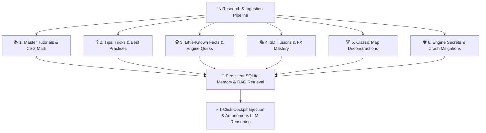

# Unreal Academy & Illusion Tricks Compendium
## Autonomous Research, 3D Optical Illusions, FX Secrets & Classic Map Deconstructions

**Author:** Kirk LaSalle & Antigravity AI Architect  
**Curriculum Version:** UAH Academy v1.0  
**Scope:** Unreal Engine 1 (1998 / UT99), Unreal Engine 2 / 2.5 (UT2003 / UT2004), Unreal Engine 5  

---

## 🌟 1. The Autonomous Learning & Research Engine

The **LearningEngine** (`core/learning_engine.py`) provides an automated research and training architecture that systematically ingests, parses, categorizes, and indexes master level design wisdom across six foundational pillars:



---

## 🎭 2. Master 3D Optical Illusions & FX Tricks

### 🪐 1. Forced-Perspective Planetary Skybox
* **Concept**: Creates the visual illusion of a titanic planet looming in the sky without bloating world polycounts or clipping geometry.
* **Technique**:
  1. Build an isolated `1024 x 1024 x 1024` subtractive cube far outside the main world coordinates (e.g. at $X=16384, Y=16384, Z=16384$).
  2. Place an `Engine.SkyZoneInfo` actor at the exact center $(0,0,0)$ of the skybox cube.
  3. Add a semi-solid cylinder or hemisphere (Radius=384, Height=128) painted with planetary terrain textures.
  4. Place a rotating 2D planar sheet above the hemisphere with translucent cloud textures (`Style=STY_Translucent`, `bUnlit=True`).
  5. In the main playable arena, select all sky ceiling surfaces and toggle `bFakeBackdrop=True`.
* **Engine Secret**: Set `SkyZoneInfo.bClipStaticMeshes=True` in UT2004 to prevent skybox objects from leaking into world depth buffers.

### 🪞 2. The Infinite Mirror Portal Corridor (WarpZone Illusion)
* **Concept**: An impossible, seamless non-Euclidean portal or infinite hallway where looking through a doorway shows another distant wing of the map.
* **Technique**:
  1. Carve two separate rooms or hallway ends with identical cross-section dimensions (e.g. $256 \times 384$).
  2. Place a 2D sheet brush across each doorway tagged as a **Zone Portal**.
  3. In each isolated doorway zone, place an `Engine.WarpZoneInfo` actor.
  4. Set `WarpZoneInfo1.ThisZone = 'PortalA'` and `WarpZoneInfo1.OtherSideURL = 'PortalB'`.
  5. Set `WarpZoneInfo2.ThisZone = 'PortalB'` and `WarpZoneInfo2.OtherSideURL = 'PortalA'`.
* **Engine Secret**: Align the surface texture coordinates of both zone portals to $(0,0)$ offset so players experience zero visual seam or camera pop when walking through.

### 💡 3. Volumetric Atmospheric God-Rays (Sunbeams & Neon Glow)
* **Concept**: Simulates volumetric atmospheric lighting, sunbeams streaming through stained glass, and glowing dust motes with 0% CPU raymarching cost.
* **Technique**:
  1. Orient a planar Sheet brush at a 45-degree angle descending from a window or roof skylight to the floor.
  2. Apply a directional gradient alpha texture (e.g. `ShaneFX.Beam1` or `UTtech1.Glow`).
  3. In Surface Properties, enable `Translucent=True`, `Unlit=True`, and `TwoSided=True`.
  4. Place an `Engine.Light` at the window origin with high brightness and complementary hue.
* **Engine Secret**: Never use solid subtractive or additive brushes for light rays; semi-solid or non-solid sheets produce **zero BSP cuts** and zero polygon tearing.

---

## 🏆 3. Hall of Fame Classic Map Deconstructions

```
┌──────────────────────────────────────────────────────────────────────────────────────────────────┐
│                                   CLASSIC MAP DECONSTRUCTIONS                                    │
├──────────────────────────────────────────────────────────────────────────────────────────────────┤
│                                                                                                  │
│   🏰 CTF-Face (Facing Worlds)                       🧪 DM-Deck16][ (Deck 16)                     │
│   ───────────────────────────                       ────────────────────────                     │
│   • 8192 UU Dual-Tower Spatial Separation           • Multi-Tier Asymmetrical Looping Flow       │
│   • 3-Tier Monolith (Base ➔ Spire ➔ Sniper Balcony) • Centerpiece Acid Slime Vat (20 dmg/s)      │
│   • High-Ground Vulnerability Tradeoff              • King-of-the-Hill UDamage Lift Perch        │
│   • Narrow Midfield Bridge Chokepoint               • Submerged Secret Escape Teleporter         │
│                                                                                                  │
│   ⛪ Temple of Chizra (Unreal 1)                    🏜️ ONS-Torlan (UT2004)                       │
│   ─────────────────────────────                     ──────────────────────                       │
│   • Grand Vaulted Nave with Sacred Crypt            • Symmetrical Canyon Core-to-Node Lattice    │
│   • TranslatorEvent Narrative Story Scrolls         • Manta / Scorpion / Raptor Vehicle Bays     │
│   • Lever & Mover Puzzle Mechanisms                 • Anti-Air AVRiL Defensive High Perches      │
│   • Indigenous Nali Monk Guides                     • Secondary Flanking River Ravines           │
│                                                                                                  │
└──────────────────────────────────────────────────────────────────────────────────────────────────┘
```

---

## 💡 4. The 75% Engine Budget Law & Little-Known Facts

### 1. The 75% Rule for Procedural CSG Stability
* **Rule**: Never allow procedural brush generators to exceed **75% of maximum engine limits**:
  * **UE1 Node Limit**: 65,536 Nodes $\rightarrow$ **UAH Target: 49,152 Nodes Max**.
  * **UE2.5 Node Limit**: 131,072 Nodes $\rightarrow$ **UAH Target: 98,304 Nodes Max**.
* **Solution**: Always convert decorative columns, cornices, crown moldings, and arch trims into **Semi-Solid Brushes** (`BRUSH ADD FLAGS=32`). Semi-solids do not cut into surrounding world polygons, eliminating up to 80% of BSP node bloat.

### 2. The 650 UU Bot Navigation Distance Law
* While the Unreal engine allows PathNodes up to 1,000 UU apart, placing nodes at **$\le$ 650 UU intervals** guarantees 100% ReachSpec coverage, preventing bots from oscillating, stalling, or getting lost in multi-floor arenas.

### 3. The LevelInfo AIController Crash Mitigator
* In Unreal Engine 2.5 (UT2004 Build 3374), `FPathBuilder::buildPaths` crashes during `PATHS BUILD` if the singleton `Engine.LevelInfo` is missing from the actor table.
* **Fix**: Always enforce `Begin Actor Class=LevelInfo` as the very first actor in all T3D imports, and use `PATHS DEFINE` + `FLUSH`.

---

*This compendium represents the living knowledgebase of the Unreal Agent Harness, continuously refined and expanded as new maps and techniques are studied.*
