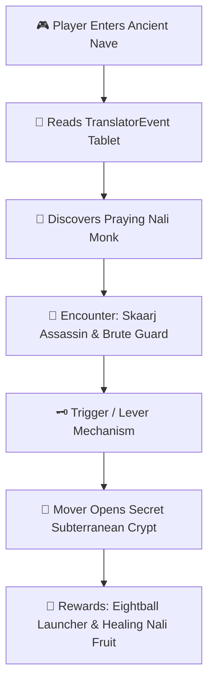

# UAH Unreal Architect Wizard Builder Guide
## Dual-Mode Procedural Level & Campaign Synthesizer

**Author & Lead Architect:** Kirk LaSalle & Antigravity AI Engineering  
**Feature Version:** UAH Wizard v3.1  
**Official Repository:** https://github.com/kirklasalle/unrealagentharness  
**Supported Engines:** Unreal 1 (1998 Namesake / UE1), UT99 GOTY (UE1), Universal Community Mods, UT2003, UT2004 (UE2.5), Unreal Engine 5.x  

---

## 🌟 1. Overview & Architectural Philosophy

The **Unreal Architect Wizard Builder** empowers level designers to build expansive 3D worlds with the depth of the original 1998 *Unreal* single-player RPG and the competitive flow of *Unreal Tournament*.

The Wizard operates in **two distinct modes**:
1. **✨ Build from Scratch (Clean-Slate Canvas)**: Synthesizes a completely new level with custom skybox bounds, outer CSG hull subtractions, fluted architectural columns, altar daises, atmospheric lighting, narrative story logs, enemy/NPC placement, and connected pathing lattices.
2. **➕ In-Situ Non-Destructive Extension (Inject to Active Map)**: Inspects the currently open level in UnrealEd and injects connected secret crypts, subterranean dungeons, sniper overlooks, or armory wings without resetting or damaging existing geometry.

---

## 🏰 2. Deep Lore & Mechanics of the 1998 "Unreal" RPG

The original *Unreal* was defined by atmospheric, non-linear exploration on the alien world of **Na Pali**. The Wizard Builder authentically recreates every core system:



### Key Unreal 1 RPG Systems Synthesized:
- **`UnrealShare.TranslatorEvent`**: Universal Electronic Translator tablets containing environmental storytelling, historical lore, puzzle clues, and warnings.
- **`UnrealShare.Nali`**: Peaceful 4-armed indigenous inhabitants who guide the player toward hidden doors and secret dispersion upgrades.
- **Enemy AI Archetypes**:
  - `UnrealShare.Brute`: Heavy armored mercenaries with twin rocket cannons.
  - `UnrealI.SkaarjWarrior`: Acrobatic alien warriors with deadly wrist blades.
  - `UnrealShare.Slith`: Acid-spitting amphibious creatures inhabiting temple canals and crypts.
- **Environmental Hazard & Ambiance**:
  - `UnrealShare.TorchFlame`: Dynamic flickering torches with Chiaroscuro lighting.
  - `UnrealShare.NaliFruit`: Indigenous healing plants restoring 15 HP.
  - `UnrealShare.DispersionPistol`: The iconic rechargeable energy sidearm.

---

## 📐 3. Clean-Slate vs. Non-Destructive Injection Logic

### Mode A: Clean-Slate Generation (`build_unreal1_rpg_campaign_level`)
Executes `MAP NEW` followed by:
1. `OBJ LOAD FILE="..\Textures\NaliCast.utx" PACKAGE=NaliCast`
2. Watertight outer hull CSG subtraction (e.g. 3584 x 2048 x 1024).
3. Additive semi-solid fluted pillars (Hexagonal 24-sided).
4. Elevated altar daises and secret subterranean crypts.
5. LevelInfo, ZoneInfo, PlayerStarts, TranslatorEvents, NPCs, weapons, and 24-node pathing lattice.
6. Rebuild & path compilation (`MAP REBUILD` $\rightarrow$ `LIGHT APPLY` $\rightarrow$ `PATHS BUILD` $\rightarrow$ `FLUSH`).

### Mode B: In-Situ Non-Destructive Injection (`inject_wing_into_existing_map`)
**Does NOT call `MAP NEW`**. Preserves every active brush and actor:
1. Calculates directional offsets relative to the anchor $(X_0, Y_0, Z_0)$:
   - **North (+Y)**: Corridors carved at $(X_0, Y_0 + 768)$, Wing carved at $(X_0, Y_0 + 1536)$.
   - **South (-Y)**: Corridors carved at $(X_0, Y_0 - 768)$, Wing carved at $(X_0, Y_0 - 1536)$.
   - **East (+X)**: Corridors carved at $(X_0 + 768, Y_0)$, Wing carved at $(X_0 + 1536, Y_0)$.
   - **West (-X)**: Corridors carved at $(X_0 - 768, Y_0)$, Wing carved at $(X_0 - 1536, Y_0)$.
2. Carves a sealed connecting doorway brush into the existing boundary wall.
3. Carves the new wing room and adds interior semi-solid columns and lighting.
4. Spawns new PathNodes bridging the old hallway into the new wing.
5. Rebuilds the BSP and lights seamlessly.

---

## 🖥️ 4. Using the Wizard Builder

### Method 1: In-Editor Cockpit UI
1. Click the purple **`🧙 WIZARD`** button in the top action bar of the Agent Harness Cockpit.
2. Choose **Build Mode**:
   - *✨ Build New Map from Scratch*
   - *➕ Non-Destructive Extension*
3. Select your **Campaign / Theme** and toggle desired **RPG Story Modules**.
4. Click **`🧙 CONJURE & BUILD IN UNREALED`**.

### Method 2: Natural Language / Autonomous LLM
The AI agent can invoke the Wizard via function calling:
```json
{
  "name": "wizard_build_level",
  "arguments": {
    "preset_key": "chizra_temple",
    "include_secret_crypt": true,
    "detail_level": "ultra"
  }
}
```

Or inject a new wing into your active map:
```json
{
  "name": "wizard_inject_extension",
  "arguments": {
    "anchor_location": [0, 0, 0],
    "wing_type": "secret_crypt",
    "direction": "North"
  }
}
```

---

*The Unreal Architect Wizard bridges procedural AI power with authentic 1998 Unreal heritage, providing an unparalleled tool for both beginners and master mappers.*
