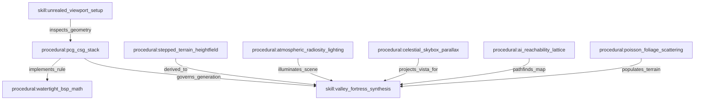

# Unreal Engine Procedural Technology: Condensed for UE99 & UnrealEd

## Executive Summary

This reference formalizes the **Unreal Engine Procedural Technology Architecture**, distilling modern procedural generation concepts (PCG graphs, geometry scripting, volumetric radiosity, and AI navmesh recast) down to the native **Unreal Engine 1 / Unreal Tournament 99 / UnrealEd 2.x (OldUnreal 469e)** CSG environment.

It serves as the permanent procedural blueprint for the **Unreal Agent Harness**, establishing how infinite outdoor worlds, mountain fortresses, and tactical arenas are synthesized deterministically while strictly obeying the **75% engine budget policy**.

---

## 1. The Core Paradigm: Solid Universe Inversion

Modern game engines (UE5, Unity, Godot) treat the world as an **empty infinite vacuum** into which positive additive meshes are placed ($Empty \to Add$).

Unreal Engine 1 operates on the **solid rock universe paradigm**:
$$\text{World Space} = \text{Infinite Solid Rock}$$
To build space, the level designer or agent must **carve negative voids** (subtractions), build **foundations** inside them (additions), and detail them with **semi-solids** and **non-solids**.

```
[ INFINITE SOLID UNIVERSE ]
            │
            ▼ (Pass 1: Subtraction)
[ PRIMARY MASTER CAVITY / CANYON HULL ]
            │
            ▼ (Pass 2: Addition)
[ STRUCTURAL BEDROCK PROMONTORIES & CLIFFS ]
            │
            ▼ (Pass 3: Subtraction)
[ FUNCTIONAL INTERIORS, ROOMS, RIVER CHASMS ]
            │
            ▼ (Pass 4: Semi-Solid Addition)
[ COLUMNS, MERLONS, STONE ARCH RIBS (PF_Semisolid=32, Zero BSP Cuts) ]
            │
            ▼ (Pass 5: Non-Solid Addition)
[ WATERFALL SHEETS, RIVER SURFACE, LIGHT BEAMS (PF_Translucent=4) ]
```

---

## 2. The 5-Layer Hierarchical CSG Stack

| Layer | Type | UnrealEd Flags | Description | Example Primitive |
| :--- | :--- | :--- | :--- | :--- |
| **1. Master Envelope** | Subtractive | `Flags=0` | Primary negative bounding void of the map. | Canyon Box ($4608 \times 4608 \times 1792$) |
| **2. Bedrock & Foundations** | Additive | `Flags=0` | Sheer rock cliffs, mountain shelves, and castle keeps. | Granite Bluff ($1792 \times 1792 \times 1024$) |
| **3. Negative Spaces** | Subtractive | `Flags=0` | Great Halls, chasm riverbeds, stairwells, and tunnels. | River Gorge ($1024 \times 4608 \times 256$) |
| **4. Architectural Multipliers** | Semi-Solid | `Flags=32` | Arches, columns, ledges, battlements, steps (0 BSP cuts). | Bridge Arch Rib, Castle Buttress |
| **5. Atmospheric Projections** | Non-Solid / Translucent | `Flags=4` / `4194432` | Water sheets, river planes, volumetric sunbeams. | Waterfall Curtain, SkyZone Ceiling |

---

## 3. Mathematical Geometry Rules for Watertight T3D Brushes

To guarantee 100% crash-free compilation without Hall of Mirrors (HOM) errors, all procedurally generated T3D brush polygons must satisfy three mathematical laws:

### Law 1: Clockwise Outward Winding
When viewing any polygon face from the outside of the brush, the vertices must be ordered in **clockwise sequence**:
$$\vec{V}_0 \to \vec{V}_1 \to \vec{V}_2 \to \dots \to \vec{V}_{k-1}$$

### Law 2: Unit Normal Vector Calculation
The polygon normal $\vec{N} = (A, B, C)$ must be the normalized cross product of the first two edge vectors:
$$\vec{E}_1 = \vec{V}_1 - \vec{V}_0, \quad \vec{E}_2 = \vec{V}_2 - \vec{V}_0$$
$$\vec{N} = \frac{\vec{E}_1 \times \vec{E}_2}{\|\vec{E}_1 \times \vec{E}_2\|}$$

### Law 3: Strict Coplanarity Verification
Every vertex $\vec{V}_i$ in the polygon must lie on the exact same plane defined by the plane equation:
$$A(x_i - x_0) + B(y_i - y_0) + C(z_i - z_0) = 0 \quad (\pm 0.001\text{ UU tolerance})$$
*If four vertices form a warped non-planar quadrilateral, the procedural generator must split the quad into two planar triangles.*

---

## 4. Procedural Terrain & Heightfield Generation in CSG

Unlike modern engines that use continuous heightmap displacement, UE1 CSG synthesizes natural outdoor terrain through stepped geometric decomposition:

1. **Beveled Rock Terraces**: Multi-tier stepped bounding volumes (`ValleyRockTerrace.t3d`) placed at irregular intervals along mountain slopes to produce natural climbable shelves.
2. **Interlocking Slope Transitions**: 30-degree and 45-degree ramp primitives (`MountainRidgeRamp.t3d`) providing smooth player and AI traversal between tiers.
3. **Subtracted River Drainage**: Chasm cuts ($256-384\text{ UU}$ depth) textured with submerged river gravel (`GenEarth.Pebbles`) and capped with a translucent water surface (`GenFluid.Water1`).
4. **Natural Faceting**: Overlapping granite rock textures (`GenEarth.Rockfac1`, `Rock8`, `grasrok2`) aligned to slope gradients.

---

## 5. Procedural Atmospheric Radiosity & Color Theory

Real-time dynamic lighting in UnrealEd 2.x follows an inverse-square attenuation sphere:
$$I(d) = \text{LightBrightness} \times \left(1 - \frac{d}{\text{LightRadius} \times 16}\right)^2$$

### The Complementary Dual-Spectrum Principle:
* **Warm Key Illumination (Sun & Torches)**:
  - `LightHue = 20 - 38` (Golden Amber / Warm Fire)
  - `LightSaturation = 100 - 220`
  - `LightBrightness = 200 - 255`
  - `LightRadius = 96 - 160`
  - `LightEffect = LE_TorchWaver` (for wall torches)
* **Cool Ambient Fill & Fluid Bounce (Sky & Water)**:
  - `LightHue = 145 - 160` (Alpine Cyan / River Blue)
  - `LightSaturation = 140 - 190`
  - `LightBrightness = 120 - 180`
  - `LightRadius = 128 - 200`
  - `LightEffect = LE_WateryShimmer` (beneath waterfalls and across water surface)
* **Outdoor Baseline Ambient**:
  - `ZoneInfo.AmbientBrightness = 55` ensures deep valley crevices are softly illuminated without total black clipping.

---

## 6. Automated AI Navigation Graph (Botpack Reachability)

The procedural generator constructs the AI path lattice simultaneously with map geometry:

1. **Reachability Grid Spacing**: Distance between adjacent `PathNode` actors $d \in [300, 650]\text{ UU}$.
2. **Floor Clearance**: All navigation nodes elevated $Z = Z_{\text{floor}} + 30\text{ UU}$ to prevent floor collision clipping.
3. **Chokepoint Triads**: Doorways, bridge entries, and gate portals receive a 3-node sequence:
   $$\text{Approach Node} (-128\text{ UU}) \longrightarrow \text{Threshold Node} (0\text{ UU}) \longrightarrow \text{Exit Node} (+128\text{ UU})$$
4. **Scout Collision Capsule Clearance**: Verified against the standard Botpack Scout cylinder ($R=42\text{ UU}, H=80\text{ UU}$).
5. **PlayerStart Isolation**: Spawns placed on grounded terrain with $\ge 128\text{ UU}$ mutual clearance and $+50\text{ UU}$ floor elevation.

---

## 7. Procedural Skybox Parallax Illusion

Infinite celestial vistas are rendered at zero collision cost:
1. **Housing**: Isolated $1024 \times 1024 \times 1024$ cube at $(X=0, Y=0, Z=4608)$ or $(X=-8192, Y=-8192, Z=4096)$.
2. **Celestial Center**: `Engine.SkyZoneInfo` actor positioned at the chamber origin with high-intensity omni-light.
3. **Parallax Ceiling**: All upper canyon ceiling surfaces flagged with:
   $$\text{Flags} = \text{PF\_FakeBackdrop} \,|\, \text{PF\_Unlit} = 4194432$$
   The player's camera angle dynamically projects the remote celestial dome across the entire valley horizon.

---

## 8. Lifelong Knowledge Graph Integration

All rules in this document are stored in the SQLite Graph Memory database (`core/memory_engine.py`):



---
*Authored for the Unreal Agent Harness lifelong knowledge base by Kirk LaSalle & Antigravity AI.*
